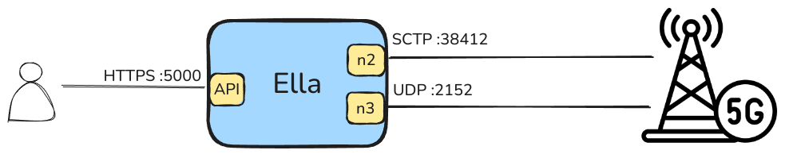

# Ella

Ella is a wireless private mobile network.

Typical mobile networks are complex, expensive, and difficult to operate. Forget microservices, external databases, complex configurations, and expensive hardware. Ella is a single binary that runs on a single machine.

Use Ella where you need 5G connectivity: in a factory, a warehouse, a farm, a stadium, a ship, or a remote location.

## Key features

* **5G compliant**: Ella is a 5G compliant core network. It can integrate with any 5G radio that support the 3GPP defined N2, and N3 interfaces.
* **Performant data plane**: Ella uses eBPF to implement the data plane. It is fast, secure, and reliable.
* **Simple UI**: Ella has a web-based user interface for managing subscribers, radios, profiles, and network slices.
* **Complete HTTP API**: Ella has a complete REST API. You can automate everything you can do in the UI.
* **Encrypted communication**: Ella's API and UI are secured with TLS.
* **Observability**: Ella exposes meaningful metrics in a Prometheus format to help you monitor your network. The UI also has a dashboard with real-time information.

## Tenets

Building Ella, we make engineering decisions based on the following tenets:
1. **Simplicity**: We are commited to develop the simplest possible mobile network out there. We thrive on having a very short "Getting Started" tutorial, a simple configuration file, a single binary, an embedded database, and a simple UI.
2. **Reliability**: We are commited to develop a reliable mobile network you can trust to work 24/7. We are commited to deliver high quality code, tests, and documentation. We are commited to expose dashboards, metrics and logs to help users monitor their network.
3. **Security**: We are commited to minimizing the attack surface of the private network and to use secure encryption protocols to protect the data of our users.

## Documentation

### Getting Started

Install the snap:

```bash
sudo snap install ella --channel=edge --devmode
```

Generate (or copy) a certificate and private key to the following location:
```bash
sudo openssl req -newkey rsa:2048 -nodes -keyout /var/snap/ella/common/key.pem -x509 -days 1 -out /var/snap/ella/common/cert.pem -subj "/CN=example.com"
```

Start the service:
```bash
sudo snap start ella.ellad
```

Navigate to `https://localhost:5000` to access the Ella UI.

### How-to Guides

#### Deploy Ella

##### Option 1: Snap

Install the snap:

```bash
sudo snap install ella --channel=edge --devmode
```

Generate (or copy) a certificate and private key to the following location:

```bash
sudo openssl req -newkey rsa:2048 -nodes -keyout /var/snap/ella/common/key.pem -x509 -days 1 -out /var/snap/ella/common/cert.pem -subj "/CN=example.com"
```

Start the service:
```bash
sudo snap start ella.ellad
```

Navigate to `https://localhost:5000` to access the Ella UI.

#### Option 2: Kubernetes (MicroK8s) with Juju

Install MicroK8s:

```shell
sudo snap install microk8s --channel=1.31/stable --classic
```

Add the necessary MicroK8s addons:

```shell
sudo microk8s addons repo add community https://github.com/canonical/microk8s-community-addons --reference feat/strict-fix-multus
sudo microk8s enable hostpath-storage
sudo microk8s enable multus
```

Install Juju:

```shell
sudo snap install juju
```

Bootstrap a Juju controller:

```shell
juju bootstrap microk8s
```

Create a Juju model:

```shell
juju add-model ella
```

```shell
juju deploy ella-k8s --trust
```

### Reference

#### Concepts

- **Network**: A network represents a private mobile network. It includes the configuration of the network, the radios, the profiles, and the subscribers.
- **Profile**: A profile is a reusable set of parameters for managing subscribers in the network. The profile includes Bitrate and Quality of Service (QoS) parameters.
- **Subscriber**: A subscriber is a user of the private mobile network.

#### API

##### Endpoints

| Endpoint                     | HTTP Method | Description                  |
| ---------------------------- | ----------- | ---------------------------- |
| `/api/v1/status`             | GET         | Get status                   |
| `/api/v1/metrics`            | GET         | Get metrics                  |
| `/api/v1/subscribers`        | GET         | List subscribers             |
| `/api/v1/subscribers`        | POST        | Create a new subscriber      |
| `/api/v1/subscribers/{name}` | GET         | Get a subscriber             |
| `/api/v1/subscribers/{name}` | DELETE      | Delete a subscriber          |
| `/api/v1/radios`             | GET         | List radios                  |
| `/api/v1/radios`             | POST        | Create a new radio           |
| `/api/v1/radios/{name}`      | GET         | Get a radio                  |
| `/api/v1/radios/{name}`      | DELETE      | Delete a radio               |
| `/api/v1/network`            | PUT         | Update network configuration |
| `/api/v1/network`            | GET         | Get network configuration    |
| `/api/v1/profiles`           | GET         | List profiles                |
| `/api/v1/profiles`           | POST        | Create a new profile         |
| `/api/v1/profiles/{name}`    | PUT         | Update a profile             |
| `/api/v1/profiles/{name}`    | GET         | Get a profile                |
| `/api/v1/profiles/{name}`    | DELETE      | Delete a profile             |

##### Responses

Ella API responses are JSON objects with the following structure:

```json
{
  "result": "Result content",
  "error": "Error message",
}
```

#### Configuration

##### Example

```yaml
log-level: "debug"  # debug, info, warn, error
db:
  path: "ella.db"
interfaces: 
  n3: 
    name: "enp3s0"
    address: "127.0.0.1"
  n6:
    name: "enp6s0"
  api:
    name: "enp0s8"
    port: 5000
    tls:
      cert: "/etc/ssl/certs/ella.crt"
      key: "/etc/ssl/private/ella.key"
```

#### Connectivity

Ella uses 4 different interfaces:

- **API**: The HTTP API and UI (HTTPS:5000)
- **N2**: The control plane interface between Ella and the 5G Radio (SCTP:38412)
- **N3**: The user plane interface between Ella and the 5G Radio (SCTP:2152)
- **N6**: The user plane interface between Ella and the internet



#### Acknowledgements

Ella is built on top of the following open source projects:
- [Aether](https://aetherproject.org/)
- [eUPF](https://github.com/edgecomllc/eupf)

#### Contributing

We welcome contributions to Ella. Please read our [Contributing Guide](CONTRIBUTING.md) to get started.
