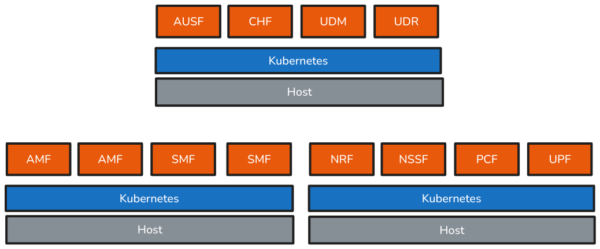
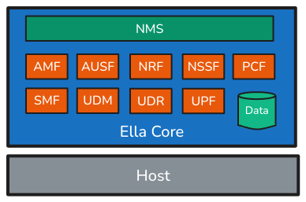

# Architecture - Combining 5G Network Functions into a Single Binary

## The problem with typical 5G networks

In a typical 5G network, the architecture is designed around a set of specialized components, collectively known as network functions (NFs). Each Network Function serves a specific role. Examples of key 5G network functions include:

- **Access and Mobility Management Function (AMF)**: Handles registration, connection, and mobility management for user devices.
- **Session Management Function (SMF)**: Manages session lifecycle and assigns IP addresses to devices.
- **User Plane Function (UPF)**: Forwards data packets to and from user devices, enabling data transfer between the device and the external network.
- **Authentication Server Function (AUSF)**: Verifies the identity of users and devices.
- **Network Slice Selection Function (NSSF)**: Allocates resources for network slicing.

These Network Functions are typically deployed as separate microservices, leveraging a distributed architecture for flexibility, scalability, and fault tolerance. However, this approach comes with significant complexity and overhead, including the need for extensive orchestration, inter-service communication, and resource management. This complexity results in high operational costs, that can be prohibitive for private deployments.

## The Ella Core approach

Ella Core was designed with the specific needs of private mobile networks in mind. For these users, simplicity, reliability, and security are what counts most. To address these requirements, we made a conscious decision to combine all 5G network functions into a single binary.

### Network Functions are abstracted away

Users only interact with Ella Core through a web-based user interface or a REST API, both of which are built into the application, and refered to as the Network Management System (NMS).

Ella Core still performs the same functions as traditional 5G networks, and behind the scenes, it implements the same 3GPP standards and protocols. However, HTTP communication between Network Functions is replaced with in-process function calls.

### The database is embedded

Persistent data is stored in an embedded database, eliminating the need for managing external databases. This design choice allows for a simple deployment process, backup and restore functionality, and (soon to be implemented) high availability features.

