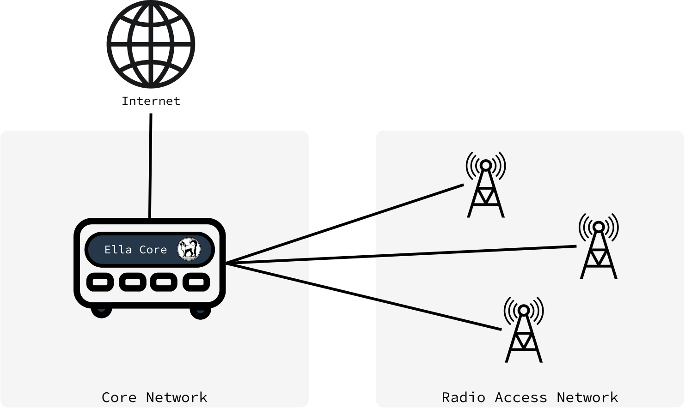
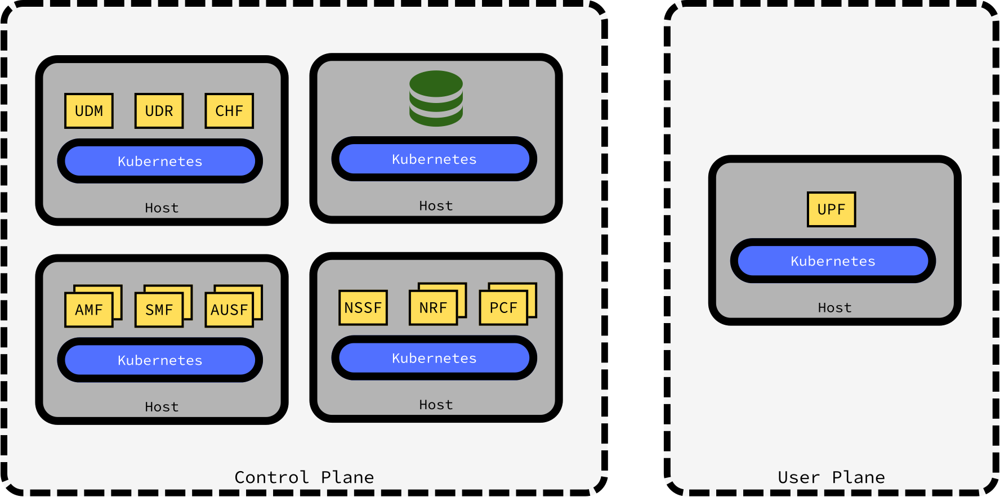
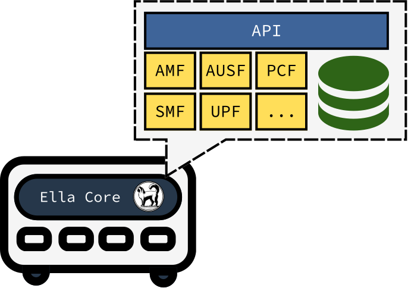

# The Ella Core Architecture Explained

## What is a 5G Network?

A 5G network represents the fifth generation of wireless technology. It brings fast data speeds, reliable low-latency communications, connectivity for IoT devices. 

<figure markdown="span">
  { width="700" }
  <figcaption>5G Overview</figcaption>
</figure>

### Components of a 5G Network

A 5G network is broadly divided into two major components: the Core Network and the Radio Access Network (RAN).

#### 1. Core Network

The 5G Core is the heart of a 5G network. It is designed to manage all data and signaling flows within the network. 

Key Functions of the 5G Core:

- **Authentication and Security**: Ensures that devices and users are authenticated and data transmission is secure.
- **Session Management**: Establishes and maintains user sessions to provide stable data and voice communication.
- **Policy**: Implements quality of service (QoS) rules.
- **Data Network Access**: Connects user devices to external data networks like the internet or private networks.

#### 2. Radio Access Network (RAN)

The Radio Access Network (RAN) is the interface between user devices and the core network. It is responsible for transmitting and receiving signals over the air, enabling connectivity between the device and the Core.

Key Components of the RAN

- **gNB (Next Generation Node B)**: The 5G base station that connects user equipment (UE) to the core network.
- **Antennas and Spectrum**: Handles communication over radio frequencies. 5G uses a range of spectrum bands, including low-band, mid-band, and high-band (millimeter wave).

## The problem with typical 5G Core Networks

Typical 5G Core networks are designed around a set of specialized components, collectively known as network functions (NFs). Each Network Function serves a specific role. Examples of key 5G network functions include:

- **Access and Mobility Management Function (AMF)**: Handles registration, connection, and mobility management for user devices.
- **Session Management Function (SMF)**: Manages session lifecycle and assigns IP addresses to devices.
- **User Plane Function (UPF)**: Forwards data packets to and from user devices, enabling data transfer between the device and the external network.
- **Authentication Server Function (AUSF)**: Verifies the identity of users and devices.
- **Network Slice Selection Function (NSSF)**: Allocates resources for network slicing.

These Network Functions are typically deployed as separate microservices, leveraging a distributed architecture for flexibility, scalability, and fault tolerance. However, this approach comes with significant complexity and overhead, including the need for extensive orchestration, inter-service communication, and resource management. This complexity results in high operational costs, that can be prohibitive for private deployments.

<figure markdown="span">
  { width="700" }
  <figcaption>A Typical 5G core architecture</figcaption>
</figure>

## The Ella Core approach

Ella Core was designed with the specific needs of private mobile networks in mind. For these users, simplicity, reliability, and security are what counts most. To address these requirements, we made the conscious decision to combine all 5G network functions into a single application.

Users only interact with Ella Core through a web-based user interface or a REST API, both of which are built into the application.

<figure markdown="span">
  { width="700" }
  <figcaption>The Ella Core approach</figcaption>
</figure>

### Network Functions are abstracted away

Ella Core still performs the same functions as traditional 5G networks, and behind the scenes, it implements the same 3GPP standards and protocols. However, HTTP communication between Network Functions is replaced with in-process function calls.

This design greatly simplifies the deployment and operation of the Core network, as there is no need to manage multiple services, databases, or network connections.

### The database is embedded

Persistent data is stored in an embedded database, eliminating the need for managing external databases. This design choice allows for a simple deployment process, backup and restore functionality, and (soon to be implemented) high availability features.
