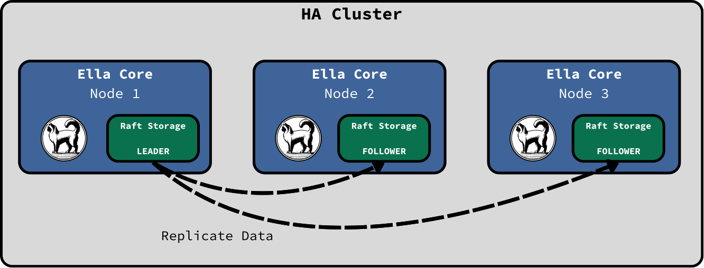
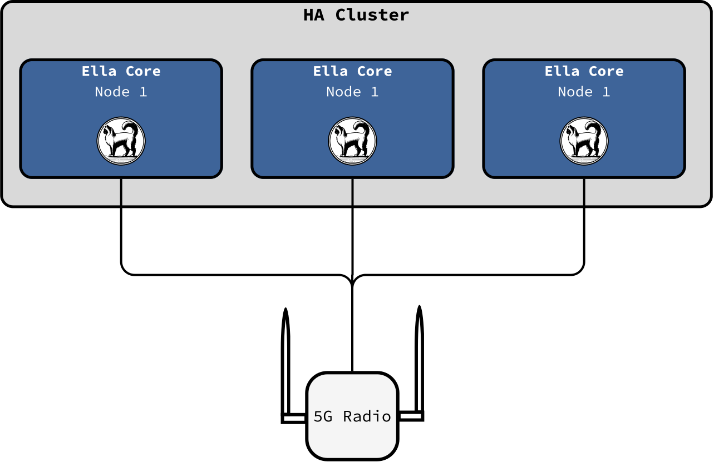
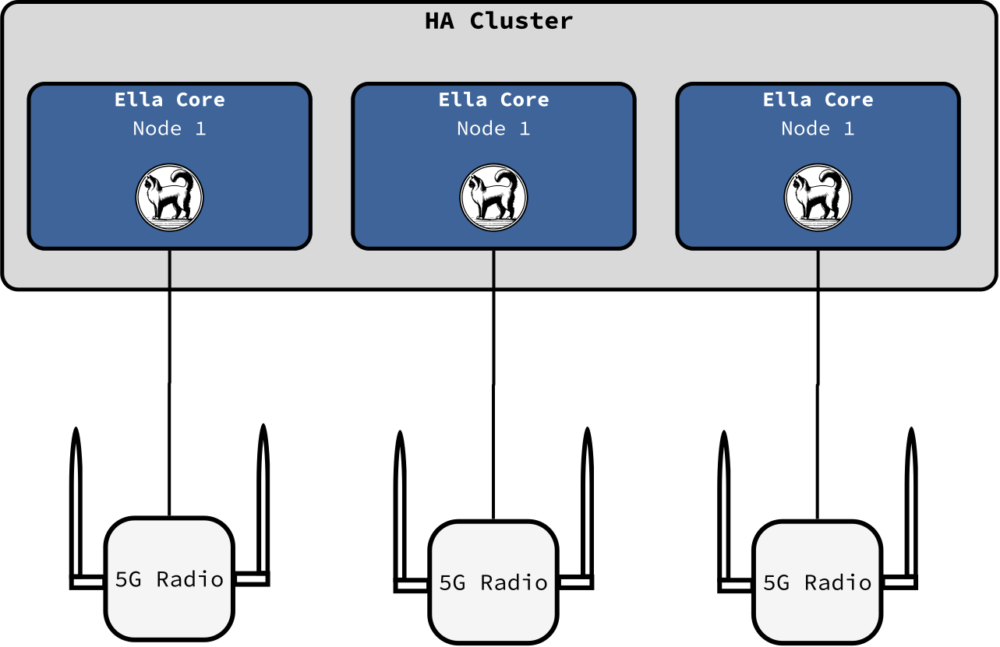

# High Availability

!!! info "Beta feature"
    High availability is currently in beta. It is available for testing and feedback in the `main` branch but not recommended for production use yet. Expect breaking changes as we iterate on the design and implementation.

High availability (HA) lets you run an Ella Core cluster so that the network keeps working when one node fails. Set `cluster.enabled: true` to opt in.

HA in Ella Core is built on the [Raft consensus algorithm](https://raft.github.io/). At any time one node is the leader; it is the only node that accepts writes. Every write replicates to a majority of nodes before it is considered committed. A follower that receives a write request forwards it to the leader transparently.

<figure markdown="span">
  { width="700" }
  <figcaption>High Availability in Ella Core</figcaption>
</figure>

## Cluster size

Deploy three or five nodes. A quorum is a majority of voters: 2 of 3, or 3 of 5. Three nodes tolerate one failure; five nodes tolerate two. Even-sized clusters offer no additional fault tolerance over N−1 and should be avoided.

## What replicates, and what does not

All persistent resources are replicated across the cluster, so if a node dies, the others have the same subscribers, policies, and operator configuration. The cluster automatically elects a new leader and keeps accepting operator changes with no manual intervention.

Runtime state tied to a specific connection or session does not replicate. This includes SCTP associations with gNBs, UE contexts, active PDU sessions and their UPF state, GTP-U tunnels, BGP peerings, and IP leases.

If a node dies, UEs re-register on surviving nodes.

## User plane and routing

A UE's user-plane traffic flows through the node that handled its registration — that node runs its UPF and terminates its GTP-U tunnel. Each data network has one cluster-wide IP pool; the replicated lease table guarantees no two UEs receive the same address, and each lease records the node currently serving it.

When BGP is enabled, each node advertises a `/32` route for every UE session it hosts (see [Advertising routes via BGP](bgp.md)). When a UE re-registers on a different node after failover, the lease's owning node is updated in place — the UE keeps its IP — and the new node's speaker begins advertising the same `/32` from its N6. The dead node's BGP session times out after the hold timer (30–180 s, peer-dependent), its routes are withdrawn, and upstream routing converges on the survivor without operator action.

## Failover and timing

Leader re-election completes within a few seconds; surviving nodes continue accepting API calls the whole time.

On the 5G side, each Ella Core node presents as a distinct AMF in the same AMF Set. A UE's 5G-GUTI pins it to the AMF that handled its registration, and new UEs distribute across the Set. When a node dies, gNBs detect the loss via SCTP heartbeat timeout — typically 15–30 seconds, governed by gNB configuration — and reselect a surviving AMF. UEs that were attached to the dead node then re-register from scratch, including a fresh authentication and a new PDU session.

## Deployment scenarios

The HA cluster is the same regardless of how gNBs connect to it; the gNB side determines how much HA reaches individual UEs.

### Radios Connected to Every Node (AMF Set)

When a Core dies, gNBs reselect within the Set automatically; affected UEs re-register on a surviving node without operator action.

<figure markdown="span">
  { width="700" }
  <figcaption>Radios Connected to Every Node (AMF Set)</figcaption>
</figure>

### Radios Pinned to Specific Nodes

Useful for site- or tenant-partitioned deployments. The cluster still replicates operator state across all nodes, so changes made anywhere are visible everywhere — but if a Core dies, its paired gNBs lose N2 and must be reconfigured to reach a surviving node. UE failover is manual, not automatic.

<figure markdown="span">
  { width="700" }
  <figcaption>Radios Pinned to Specific Nodes</figcaption>
</figure>

## Rolling upgrades

Upgrades proceed one node at a time: drain, remove, upgrade, rejoin as non-voter, promote. Writes continue throughout; the cluster is briefly mixed-version during each swap.

To keep a mixed-version cluster consistent, the leader applies a schema migration only once every voter's binary supports it, and refuses to admit a new voter whose schema trails what the cluster has already applied. Skip-version upgrades (`vN → vN+2`) and downgrades are not supported.

## Non-goals

HA is not a seamless-continuation system. Decisions with product impact:

- **UE context is not replicated.** UEs re-register on failover; existing NAS security state and PDU sessions are lost.
- **Active PDU sessions do not persist across nodes.** The replacement session starts fresh, with a new IP from the surviving node's pool.
- **NAT conntrack is not mirrored.** Outbound flows for existing sessions reset when their node fails.
- **Cluster TLS certificates are not hot-reloaded.** Rotation requires a node restart; PKI is operator-managed out of band.

## Further reading

- [Cluster API reference](../reference/api/cluster.md) — cluster management endpoints.
