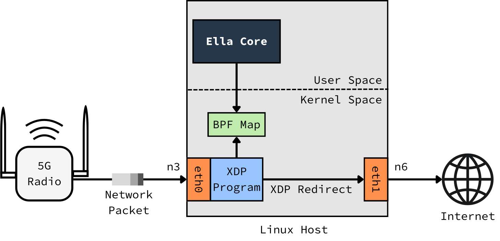

# Data Plane Packet processing with eBPF

This document explains the key concepts behind packet Ella Core's packet processing. It covers the components, workflow, and technologies used in the data plane. We refer to the data plane as the part of Ella Core that processes subscriber data packets.

## eBPF and XDP

[eBPF](https://ebpf.io/) is a technology that allows custom programs to run in the Linux kernel. eBPF is used in various networking, security, and performance monitoring applications.

[XDP](https://www.iovisor.org/technology/xdp) provides a framework for eBPF that enables high-performance programmable packet processing in the Linux kernel.

## Data Plane Packet processing in Ella Core

Ella Core's data plane uses XDP to achieve high throughput and low latency. Key features include:

- **Policy rules enforcement**: Evaluating ordered per-policy uplink and downlink rules to allow or deny traffic based on remote prefix, protocol, and port range.
- **Encapsulation and decapsulation**: Managing GTP-U (GPRS Tunneling Protocol-User Plane) headers for data transmission.
- **Rate limiting**: Enforcing Quality of Service (QoS) with QER (QoS Enforcement Rules).
- **Flow reporting**: Recording per-flow traffic details including source, destination, protocol, port, and whether the flow was allowed or dropped.
- **Usage reporting**: Aggregating per-subscriber byte and packet counts for data usage tracking.
- **Statistics collection**: Monitoring metrics such as packet counts, drops, and processing times.

Data plane processing in Ella Core occurs between the **n3** and **n6** interfaces.

<figure markdown="span">
  { width="800" }
  <figcaption>Packet processing in Ella Core with eBPF and XDP (Simplified to only show N3->N6).</figcaption>
</figure>

### Routing

Ella Core currently relies on the kernel to make routing decisions for incoming network packets. Kernel routes can be configured using the [Networking API](../reference/api/networking.md) or the user interface.

### NAT

Network Address Translation (NAT) simplifies networking as it lets subscribers use private IP addresses without requiring an external router. It uses Ella Core's N6 IP as the source for outbound traffic. Enabling NAT adds processing overhead and some niche protocols won't work (e.g., FTP active mode). You can enable NAT in Ella Core by navigating to the `Networking` page in the UI and enabling the `NAT` option or by using the [Networking API](../reference/api/networking.md).

### Performance

Detailed performance results are available [here](../reference/performance.md).

### Configuration

Ella Core supports the following XDP attach modes:

- **Native**: This is the most performant option, but it is only supported on [compatible drivers](https://github.com/iovisor/bcc/blob/master/docs/kernel-versions.md#xdp).
- **Generic**: A fallback option that works on most drivers but with lower performance.

For more information on configuring XDP attach modes, refer to the [Configuration File](../reference/config_file.md) documentation.

### XDP redirect on veth pairs

When Ella Core's N3 interface is a veth pair (e.g. in [co-hosted deployments](../how_to/co_host_with_ocudu.md)), the XDP data plane uses `bpf_redirect()` to forward downlink packets from N6 to N3. In **native XDP mode**, this requires an XDP program on **both sides** of the veth pair.

Without an XDP program on the receiving peer, the veth driver will not deliver redirected frames through the native path and the frames will be dropped.

The solution is to attach a minimal XDP program that returns `XDP_PASS` to the peer veth. This satisfies the kernel's requirement and keeps packets on the fast native XDP path. See [Use native XDP with veth interfaces](../how_to/native_xdp_veth.md) for setup instructions.

### IPv6 GTP-U transport

Ella Core supports GTP-U encapsulation with either an IPv4 or IPv6 outer header on the N3 interface (dual-stack transport). The UE payload remains IPv4 or IPv6 regardless of the transport address family.

**Downlink (N6 → N3):** When a Forwarding Action Rule (FAR) specifies `OHC_GTP_U_UDP_IPv6`, the XDP program builds an IPv6 outer header and routes the packet via `route_ipv6()`. For IPv4 outer headers the existing `OHC_GTP_U_UDP_IPv4` path is used unchanged.

**Uplink (N3 → N6):** `handle_ip6()` detects GTP-U packets arriving on the N3 interface by checking for UDP destination port 2152. The outer IPv6 header is stripped by `remove_gtp_header()`, which accounts for the larger IPv6 header (40 bytes vs 20 bytes for IPv4).

**MTU handling:** The encapsulation overhead constants `GTP_ENCAP_SIZE_IPV4` (44 bytes) and `GTP_ENCAP_SIZE_IPV6` (64 bytes) are used for MTU checks. If a downlink packet exceeds the path MTU on an IPv6 transport path, an ICMPv6 Packet Too Big message is generated and returned to the sender.

**GTP echo:** Echo Request/Response messages are handled for both IPv4 and IPv6 transport, as required for GTP-U path management.
