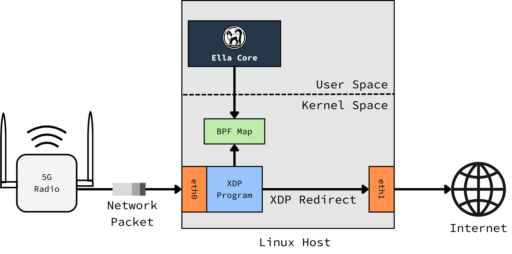

# Data Plane Packet processing with eBPF

This document explains the key concepts behind packet Ella Core's packet processing. It covers the components, workflow, and technologies used in the data plane. We refer to the data plane as the part of Ella Core that processes subscriber data packets.

## eBPF, XDP, and TCX

[eBPF](https://ebpf.io/) is a technology that allows custom programs to run in the Linux kernel. eBPF is used in various networking, security, and performance monitoring applications.

[XDP](https://www.iovisor.org/technology/xdp) provides a framework for eBPF that enables high-performance programmable packet processing in the Linux kernel. XDP runs in the network driver, before the kernel builds a socket buffer for the packet.

TCX is a second attach point, added in kernel 6.6. It runs later, on the socket buffer, and is available on every interface regardless of driver support.

## Data Plane Packet processing in Ella Core

Ella Core's data plane uses eBPF to achieve high throughput and low latency. Key features include:

- **Policy rules enforcement**: Evaluating ordered per-policy uplink and downlink rules to allow or deny traffic based on remote prefix, protocol, and port range.
- **Encapsulation and decapsulation**: Managing GTP-U (GPRS Tunneling Protocol-User Plane) headers for data transmission.
- **Rate limiting**: Enforcing Quality of Service (QoS) with QER (QoS Enforcement Rules).
- **Flow reporting**: Recording per-flow traffic details including source, destination, protocol, port, and whether the flow was allowed or dropped.
- **Usage reporting**: Aggregating per-subscriber byte counts for data usage tracking.
- **Statistics collection**: Monitoring metrics such as packet counts, drops, and processing times.

Data plane processing in Ella Core occurs between the **N3 / S1-U** and **N6 / SGi** interfaces.

<figure markdown="span">
  { width="800" }
  <figcaption>Packet processing in Ella Core with eBPF and XDP (Simplified to only show N3->N6).</figcaption>
</figure>

### Routing

Ella Core currently relies on the kernel to make routing decisions for incoming network packets. Kernel routes can be configured using the [Networking API](../reference/api/networking.md) or the user interface.

### NAT

Network Address Translation (NAT) simplifies networking as it lets subscribers use private IP addresses without requiring an external router. It uses Ella Core's N6 IP as the source for outbound traffic. Inbound traffic is only delivered to a subscriber when it belongs to a connection the subscriber initiated; packets addressed directly to a subscriber's IP address are dropped and counted in the `app_xdp_nat_unsolicited_drop_total` metric. To reach subscribers from the data network, disable NAT and route the UE pool instead. NAT is IPv4-only and does not apply to IPv6 traffic. Enabling NAT adds processing overhead, and traffic it cannot translate is dropped and counted in `app_xdp_nat_drop_total`: IP fragments, and protocols without ports (for example ESP, GRE and SCTP). Some niche protocols won't work either (e.g., FTP active mode). Source ports are allocated from 1024-32767. You can enable NAT in Ella Core by navigating to the `Networking` page in the UI and enabling the `NAT` option or by using the [Networking API](../reference/api/networking.md).

### Performance

Detailed performance results are available [here](../reference/performance.md).

### Configuration

Ella Core supports the following attach modes:

- **`xdp-native`**: The production-grade option. It offers the highest performance but is only supported on [compatible drivers](https://github.com/iovisor/bcc/blob/master/docs/kernel-versions.md#xdp).
- **`tcx`**: Attaches at the TCX hook. It works on any interface, including the veth pairs used in containers and [co-hosted deployments](../how_to/co_host_with_ocudu.md), and requires kernel 6.6 or later. Performance is lower than native XDP because the kernel has already built a socket buffer for the packet.
- **`xdp-generic`**: A driver-independent XDP fallback intended for prototyping and test/development only. It has lower performance and is less reliable (see [Checksum offload on veth pairs](#checksum-offload-on-veth-pairs)). Do not use it in production.

For more information on configuring attach modes, refer to the [Configuration File](../reference/config_file.md) documentation.

### XDP redirect on veth pairs

When Ella Core's N3 interface is a veth pair (e.g. in [co-hosted deployments](../how_to/co_host_with_ocudu.md)), the data plane uses `bpf_redirect()` to forward downlink packets from N6 to N3. In **`xdp-native` mode**, this requires an XDP program on **both sides** of the veth pair.

Without an XDP program on the receiving peer, the veth driver will not deliver redirected frames through the native path and the frames will be dropped.

The solution is to attach a minimal XDP program that returns `XDP_PASS` to the peer veth. This satisfies the kernel's requirement and keeps packets on the fast native XDP path. See [Use native XDP with veth interfaces](../how_to/native_xdp_veth.md) for setup instructions.

### Checksum offload on veth pairs

When an application transmits over a veth interface, the kernel defers computing the transport checksum: the packet carries `CHECKSUM_PARTIAL` metadata recording where the egress NIC should write the checksum later. GTP-U traffic sent by a co-hosted radio therefore reaches Ella Core's N3 interface with an incomplete outer UDP checksum.

In **`xdp-generic` mode**, the kernel does not update this metadata when the data plane removes the GTP-U header. The egress path then completes the checksum at the stale offset, corrupting the decapsulated frame at a position that depends on the removed header length. The failure is invisible to the data plane counters and to packet captures on the host.

**`xdp-native` and `tcx` modes are not affected.** Native XDP forwards redirected frames as raw packets, which carry no checksum-offload metadata. On TCX, the kernel discards the stale metadata when the data plane removes the GTP-U header, so the checksum is completed in software.

For `xdp-generic` only, the remedy is to disable TX checksum offload on both ends of the veth pair (`ethtool -K <veth> tx off`), forcing checksums to be completed in software before packets reach the data plane.

### Segmentation offload on TCX

TCX runs after the kernel has merged incoming packets with Generic Receive Offload (GRO), so downlink encapsulation can be applied to a merged frame larger than the MTU. The kernel splits that frame back into MTU-sized packets on transmit, and recomputes the outer IP and UDP **lengths** of each one, but not the outer UDP **checksum**.

An IPv4 outer header is unaffected, because a zero UDP checksum is valid over IPv4. An IPv6 outer header requires a valid UDP checksum, so every segment but the first is discarded by the receiver.

IPv6 GTP-U transport in `tcx` mode therefore requires GRO to be disabled on the interface that receives downlink traffic: `ethtool -K <n6-interface> gro off`. Persist the setting through your network configuration, and verify it with `ethtool -k <n6-interface>`. In virtual machines, GRO may be reported as `[fixed]` or performed by the hypervisor, in which case IPv6 GTP-U transport is not supported in `tcx` mode.

The `xdp-native` and `xdp-generic` modes are not affected: XDP runs before GRO and only ever sees MTU-sized frames.

### IPv6 GTP-U transport

Ella Core supports GTP-U encapsulation with either an IPv4 or IPv6 outer header on the N3 / S1-U interface. The inner UE payload can be IPv4 or IPv6, independent of the transport address family. The chosen transport address family depends on how the N3 / S1-U interface is configured, and what the radio advertises. If both sides are dual-stack, Ella Core prefers IPv6.

**GTP echo:** Echo Request/Response messages are handled for both IPv4 and IPv6 transport, as required for GTP-U path management.

**`tcx` mode:** IPv6 transport requires GRO to be disabled on the N6 interface — see [Segmentation offload on TCX](#segmentation-offload-on-tcx).
