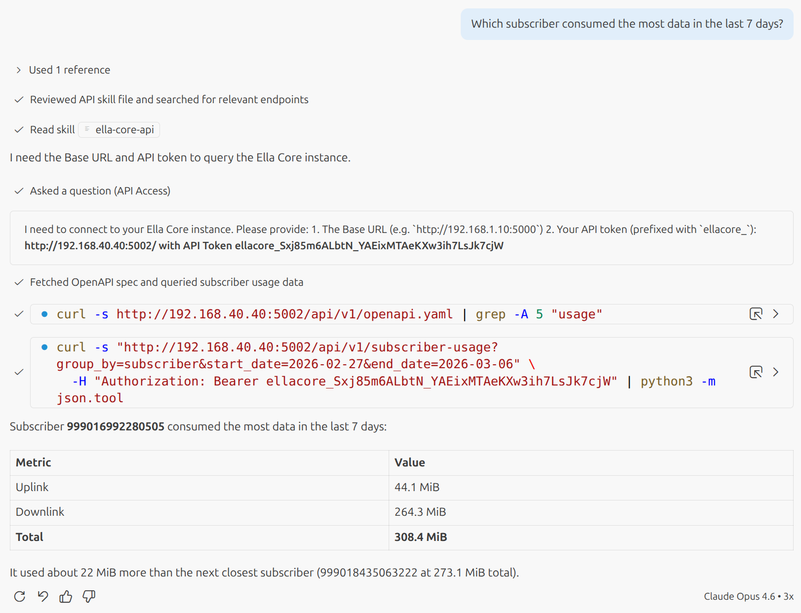

# Manage Your Network with AI Agents

Ella Core ships with an [Agent Skill](https://agentskills.io/) that lets AI agents manage your 5G network using natural language. The skill provides the OpenAPI specification so agents can discover and call the REST API on your behalf.

## Prerequisites

Before using the skill, you need:

1. **A running Ella Core instance** with its API accessible (e.g. `http://192.168.1.10:5000`).
2. **An API token** — create one in the Ella Core UI under your user profile, or via the API. Tokens are prefixed with `ellacore_`.

## 1. Install the skill

Download [`SKILL.md`](https://raw.githubusercontent.com/ellanetworks/core/main/.github/skills/ella-core-api/SKILL.md) and place it in a skills directory that your AI tool can discover (e.g. `<project>/.agents/skills/ella-core-api/SKILL.md`).

## 2. Prompt the agent

Once the skill is active, you can ask things like "Which subscriber consumed the most data in the last 7 days?".

<figure markdown="span">
  { width="700" }
  <figcaption>Claude Opus Response to "Which subscriber consumed the most data in the last 7 days?"</figcaption>
</figure>
