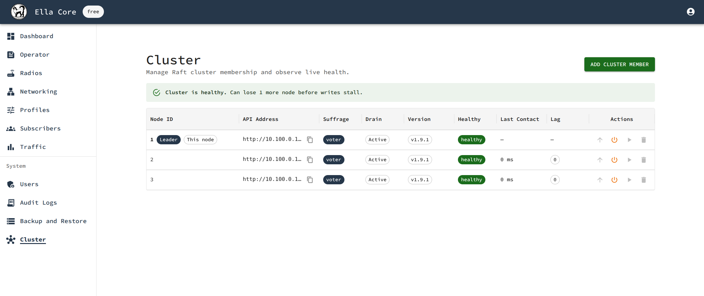

# Deploy a High Availability Cluster (beta)

This guide walks through bringing up a three-node Ella Core cluster from scratch. For background on how clustering works, see the [High Availability](../explanation/high_availability.md) explanation.

!!! info "Beta feature"
    High availability is currently in beta. It is available for testing and feedback in the `main` branch but not recommended for production use yet. Expect breaking changes as we iterate on the design and implementation.

## Pre-requisites

- Three hosts that each meet the standard [system requirements](../reference/system_reqs.md).
- Ella Core installed on each host following the [Install](install.md) guide. Do **not** start the service yet.
- A reachable TCP port on each host for inter-node traffic (this guide uses `7000`).

## 1. Generate the cluster PKI

Every node authenticates to its peers with a leaf certificate signed by a shared cluster CA. The leaf's Common Name must be `ella-node-<node-id>`, where `node-id` matches `cluster.node-id` in the node's config. `node-id` must be between 1 and 63.

Using OpenSSL, create a CA and one leaf per node:

```shell
# Cluster CA
openssl ecparam -name prime256v1 -genkey -noout -out cluster-ca-key.pem
openssl req -x509 -new -key cluster-ca-key.pem -days 3650 \
    -subj "/CN=ella-cluster-ca" -out cluster-ca.pem

# Per-node leaf (repeat for node-id 1, 2, 3)
NODE_ID=1
openssl ecparam -name prime256v1 -genkey -noout -out node-${NODE_ID}-key.pem
openssl req -new -key node-${NODE_ID}-key.pem \
    -subj "/CN=ella-node-${NODE_ID}" -out node-${NODE_ID}.csr
openssl x509 -req -in node-${NODE_ID}.csr \
    -CA cluster-ca.pem -CAkey cluster-ca-key.pem -CAcreateserial \
    -days 365 -out node-${NODE_ID}-cert.pem \
    -extfile <(printf "extendedKeyUsage=serverAuth,clientAuth")
```

Copy `cluster-ca.pem`, the node's own `node-N-cert.pem`, and `node-N-key.pem` to each host (for example, under `/etc/ella/`).

## 2. Configure each node

On every node, add a `cluster` block to the configuration file. The example below is for node 1; change `node-id`, `bind-address`, and the TLS paths on each of the other two nodes. The `peers` list and `bootstrap-expect` must be identical on all three.

```yaml title="core.yaml"
interfaces:
  n2:
    address: "10.0.0.1"
    port: 38412
  n3:
    name: "n3"
  n6:
    name: "eth0"
  api:
    address: "10.0.0.1"
    port: 5002
xdp:
  attach-mode: "native"
cluster:
  enabled: true
  node-id: 1
  bind-address: "10.0.0.1:7000"
  bootstrap-expect: 3
  peers:
    - "10.0.0.1:7000"
    - "10.0.0.2:7000"
    - "10.0.0.3:7000"
  tls:
    ca: "/etc/ella/cluster-ca.pem"
    cert: "/etc/ella/node-1-cert.pem"
    key: "/etc/ella/node-1-key.pem"
```

See the [Configuration File](../reference/config_file.md#clustering) reference for every available field.

## 3. Start the nodes

Start Ella Core on all three hosts, order does not matter.

 ```shell
sudo snap start --enable ella-core.cored
```

## 4. Initialize the cluster

Open any node's UI in a browser (for example `https://10.0.0.1:5002`) and create the first admin user when prompted. The write is replicated through Raft to the other members, so you only do this once.

Log in.

## 5. Verify the cluster

Navigate to the **Cluster** page. All three nodes should appear with suffrage **Voter**, one should be flagged as **Leader**, and every node should report **Healthy**.

<figure markdown="span">
  { width="800" }
  <figcaption>Cluster page showing three nodes with one leader</figcaption>
</figure>
