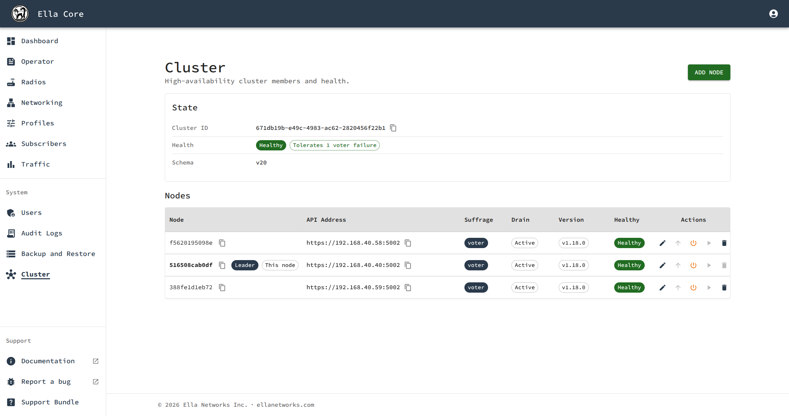

# Deploy a High Availability Cluster

Ella Core can be deployed as a high-availability cluster to provide redundancy and failover capabilities. See [High Availability](../explanation/high_availability.md) for more information.

## Prerequisites

- Three hosts meeting the standard [system requirements](../reference/system_reqs.md).
- Ella Core installed on each host via the [Install](install.md) guide. Do **not** start the service yet.
- A reachable TCP port on each host for inter-node traffic (this guide uses `7000`).

## 1. Configure node 1

Put this in `core.yaml` on node 1. Adjust interface names, addresses, and ports to match the host.

```yaml title="core.yaml (node 1)"
logging:
  system:
    level: "info"
    output: "stdout"
  audit:
    output: "stdout"
db:
  path: "/var/snap/ella-core/common/data/ella.db"
interfaces:
  n2:
    address: "10.0.0.1"
    ngap-port: 38412
  n3:
    name: "n3"
  n6:
    name: "eth0"
  api:
    address: "10.0.0.1"
    port: 5002
datapath:
  attach-mode: "xdp-native"
cluster:
  bind-address: "10.0.0.1:7000"
```

## 2. Start node 1

```shell
sudo snap start --enable ella-core.cored
```

## 3. Create the admin user

Open `https://10.0.0.1:5002` in a browser, create the admin, and log in. Creating the admin founds the cluster on this node.

## 4. Add node 2

On node 1, open the **Cluster** page and click **Add Node**, click **Mint Token**, then copy the token.

Create `core.yaml` on node 2 using the same shape as node 1, with `bind-address: "10.0.0.2:7000"`:

```yaml title="core.yaml (node 2, cluster block)"
cluster:
  bind-address: "10.0.0.2:7000"
```

Start node 2:

```shell
sudo snap start --enable ella-core.cored
```

Open `https://10.0.0.2:5002` in a browser. On the **Join a cluster** page, paste the token, enter node 1's cluster address `10.0.0.1:7000`, and click **Join**.

## 5. Add node 3

Repeat step 4 on node 3.

## 6. Verify

On the **Cluster** page, all three nodes appear as **Voter**, one as **Leader**, all **Healthy**.

<figure markdown="span">
  { width="800" }
</figure>
