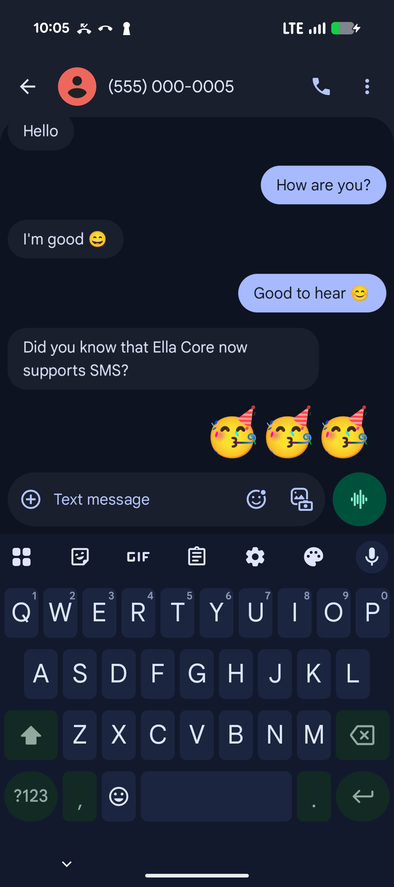

# Enable SMS

Ella Core can be integrated with one or more external Short Message Service Centers (SMSC) to allow subscribers in your private mobile network to communicate via SMS.

This guide uses [Ella SMSC](https://github.com/ellanetworks/smsc) to enable SMS, but any 3GPP-compliant SMSC can be used.

## 1. Configure the SMSC

Set your SMSC's HSS realm to `epc.mnc<MNC>.mcc<MCC>.3gppnetwork.org`, using your network's MCC and 3-digit MNC.

Example: `epc.mnc001.mcc001.3gppnetwork.org`

## 2. Connect Ella Core to the SMSC

In the Ella Core UI, go to the Operator page and scroll to the **SMS** section.

Click **Add Service Center** and configure the following settings:

- **Address**: your SMSC's Diameter IP address.
- **Numbers**: the E.164 service centre addresses your SMSC serves, e.g. `+15550000000`.

Click **Add**.

Validate that each service center's **Status** shows **Connected**.

## 3. Give subscribers an MSISDN

For each subscriber that should send or receive SMS:

- Go to the **Subscribers** page and click on the subscriber you want to configure.
- In Provisioning, click the edit icon next to MSISDN.
- Enter the subscriber's E.164 number, e.g. `+15551230001`, and click on **Update**.

## 4. Set the SMSC number on the phones

On each phone's SIM, set the SMSC number to one of your SMSCs' service centre numbers, e.g. `+15550000000`.

## 5. Send a test SMS

Send a test SMS message from a phone to another in your private mobile network. The message should be delivered successfully.

<figure markdown="span">
  { width="200" }
  <figcaption>Enable SMS in Ella Core</figcaption>
</figure>
