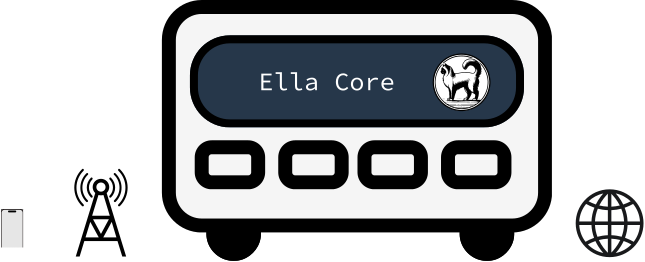

# Ella Core

  

**Ella Core** is a 5G core designed for private networks. It simplifies the complexity of traditional 5G networks into a single, easy-to-operate solution that is reliable and secure.

Use Ella Core where you need 5G connectivity: in a factory, a warehouse, a farm, a stadium, a ship, a military base, or a remote location.

## Key features

- **5G Compliant**: Ella Core implements 3GPP-standard interfaces and has been validated with multiple 5G radios, including integrated and software-defined RANs, commercial phones and devices. It is 5G RedCap compliant for IoT deployments.
- **Performant Data Plane**: Achieve high throughput and low latency with an eBPF-based data plane. Ella Core delivers over 10 Gbps of throughput and less than 1 ms of latency.
- **Lightweight**: Ella Core is a single binary with an embedded database, making it easy and quick to stand up. It requires as little as 1 CPU core, 1GB of RAM, and 10GB of disk space. Forget specialized hardware; all you need to operate your 5G core network is a Linux system with a network interface.
- **Intuitive User Experience**: Manage subscribers, radios, data networks, policies, and operator information through a user-friendly web interface. Automate network operations with a complete REST API.
- **Real-Time Observability**: Access logs, metrics, traces, profiles, and dashboards to monitor network health through the UI, the Prometheus-compliant API, or an OpenTelemetry collector.
- **Backup and Restore**: Backup and restore your data in 1 click.
- **Audit Logs**: At any moment, keep track of who did what and when on your network.
- **Open Source**: Ella Core is open source and available under the Apache 2.0 license.

## In this documentation

-   [__Tutorials__](tutorials/index.md)

    ---

    **Start here**: a hands-on introduction to Ella Core for new users. Install, configure, and initialize Ella Core in minutes.

-   [__How-to Guides__](how_to/index.md)

    ---

    **Step-by-step guides** covering key operation and common tasks.

-   [__Reference__](reference/index.md)

    ---

    **Technical information** - API, configuration, performance, metrics, and more.

-   [__Explanation__](explanation/index.md)

    ---

    **Discussion and clarification** of key topics.

