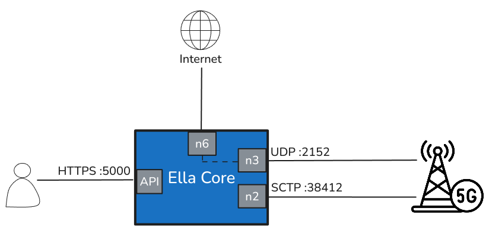

# Connectivity

Ella Core uses 4 different interfaces:

- **API**: The HTTP API and UI (HTTPS:5000)
- **N2**: The control plane interface between Ella Core and the 5G Radio (SCTP:38412)
- **N3**: The user plane interface between Ella Core and the 5G Radio (SCTP:2152)
- **N6**: The user plane interface between Ella Core and the internet

{ align=left }
