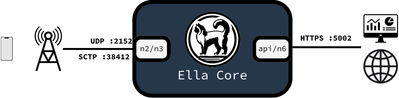

# Connectivity

Ella Core uses 4 different interfaces by default:

| Interface | Role | Transport | `name` | `address` | Address families |
| --------- | ---- | --------- | ------ | --------- | ---------------- |
| API | The HTTP API and UI | TCP, `interfaces.api.port` | Yes | Yes | IPv4, IPv6 |
| N2 / S1-MME | Control plane between Ella Core and the radio | SCTP, `38412` (5G) and `36412` (4G) by default | Yes | Yes | IPv4, IPv6. |
| N3 / S1-U | User plane between Ella Core and the radio | UDP `2152` | Yes | Yes | IPv4, IPv6. |
| N6 / SGi | User plane between Ella Core and the internet | — | Yes | No | Not configurable |

<figure markdown="span">
  { width="800" }
  <figcaption>Connectivity in Ella Core</figcaption>
</figure>

## Combining interfaces

It is possible to combine interfaces in the following manners.

### Combined N2 and N3

Many radios can use a single network link towards the core. In this case, N2 and N3 can be combined by using the same interface name for both of them in the configuration file.

<figure markdown="span">
  { width="800" }
  <figcaption>Combined N2 and N3</figcaption>
</figure>

### Combined API and N6

The API interface is often the network interface with internet access, and the N6 interface also requires internet access. They can be combined by using the same interface name for both in the configuration file.

<figure markdown="span">
  { width="800" }
  <figcaption>Combined API and N6</figcaption>
</figure>

### Combined API/N6 and combined N2/N3

It is possible to use both combination together to reduce the requirements to 2 interfaces.

<figure markdown="span">
  { width="800" }
  <figcaption>Combined All</figcaption>
</figure>

One or both of these interfaces can be virtual interfaces, with `veth`. See [Datapath constraints](#datapath-constraints).

### Combined on one interface

Ella Core can also be run with a single network interface. It can be achieved by using the same interface name in the configuration file, or by using VLANs.

## Using VLANs

It is possible to use VLAN interfaces, with or without combining interfaces
as described previously. In this case, the configuration file should contain
the name of the VLAN interface, not the parent interface.

## Datapath constraints

The datapath attaches to N3 and N6 at the hook set by `datapath.attach-mode`. The shape of those interfaces constrains which modes work.

- **veth, `xdp-native`**: an XDP program must be attached to the peer interface, see the [explanation](../explanation/user_plane_packet_processing_with_ebpf.md#xdp-redirect-on-veth-pairs) and the [setup guide](../how_to/native_xdp_veth.md).
- **veth, `xdp-generic`**: TX checksum offload must be disabled on both ends, see the [explanation](../explanation/user_plane_packet_processing_with_ebpf.md#checksum-offload-on-veth-pairs).
- **Any interface, `tcx` or `xdp-generic`**: the interface must not deliver merged packets, see [Disable merged packets](../how_to/disable_merged_packets.md). 

## NAT

| Property | Behaviour |
| -------- | --------- |
| Address family | IPv4 only |
| Scope | Uplink traffic leaving N6, sourced from the N6 address |
| Source ports | `1024`-`32767` |
| Downlink traffic | Delivered only when it matches a translation the subscriber's own traffic created. |
| Untranslatable traffic | IP fragments (`nat_fragment`) and protocols without ports, such as ESP and GRE (`nat_unsupported_proto`), are dropped. Protocols that embed addresses in their payload, such as FTP in active mode, do not work |
| Configuration | The `Networking` page of the UI, or the [Networking API](api/networking.md) |
