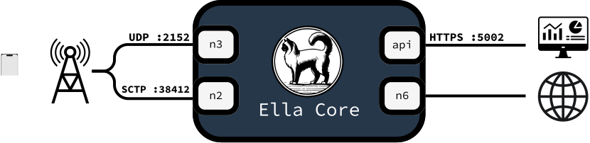

# Connectivity

Ella Core uses 4 different interfaces by default:

- **API**: The HTTP API and UI (HTTPS:5002)
- **N2**: The control plane interface between Ella Core and the 5G Radio (SCTP:38412)
- **N3**: The user plane interface between Ella Core and the 5G Radio (SCTP:2152)
- **N6**: The user plane interface between Ella Core and the internet

<figure markdown="span">
  { width="800" }
  <figcaption>Connectivity in Ella Core</figcaption>
</figure>

# Combining interfaces

It is possible to combine interfaces in the following manners.

## Combined N2 and N3

Many gNodeBs can use a single network link towards the core. In this case,
N2 and N3 can be combined by using the same interface name for both of them in the
configuration file.

<figure markdown="span">
  { width="800" }
  <figcaption>Combined N2 and N3</figcaption>
</figure>

## Combined API and N6

The API interface is often the management interface with internet access,
and the N6 interface also requires internet access. They can be combined by using
the same interface name for both in the configuration file.

<figure markdown="span">
  { width="800" }
  <figcaption>Combined API and N6</figcaption>
</figure>

## Combined API/N6 and combined N2/N3

It is possible to use both combination together to reduce the requirements
to 2 interfaces.

<figure markdown="span">
  { width="800" }
  <figcaption>Combined All</figcaption>
</figure>

While this is the minimum requirements for Ella Core, one or both of these
interfaces can be virtual interfaces, with `veth`. Refer to your
distribution's documentation on how to set this up.

# Using VLANs

It is possible to use VLAN interfaces, with or without combining interfaces
as described previously. In this case, the configuration file should contain
the name of the VLAN interface, not the parent interface.

Currently, there is a limitation that prevents using VLAN interfaces on the
same parent interface for N3 and N6.
