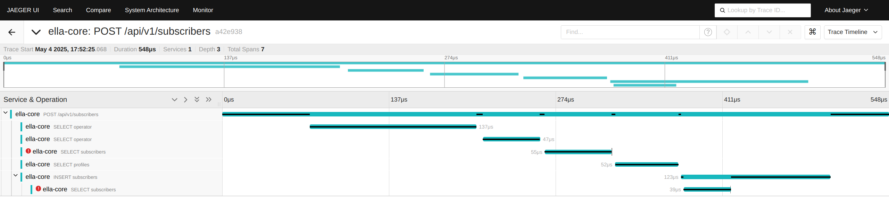

# Observability

Ella Core supports four observability pillars: Metrics, Logs, Traces, and Profiles.

## 1. Metrics

Ella Core exposes [Prometheus](https://prometheus.io/) metrics to monitor the health of an Ella Core instance.

### Default Go metrics

These metrics are used to monitor the health of the Go runtime and garbage collector. These metrics start with the `go_` prefix.

### Custom metrics

These metrics are used to monitor the health of the system and the performance of the network. These metrics start with the `app_` prefix. The following custom metrics are exposed by Ella Core:

| Metric | Description    | Type  |
| ------------------- | --------- | --------- |
| app_connected_radios            | Number of radios currently connected to Ella Core                  | Gauge   |
| app_ngap_messages_total | Total number of received NGAP message per type | Counter |
| app_registered_subscribers      | Number of subscribers currently registered in Ella Core            | Gauge   |
| app_registration_attempts_total | Total number of UE registration attempts by type and result | Counter |
| app_pdu_sessions_total | Number of PDU sessions currently in Ella Core. | Gauge |
| app_pdu_session_establishment_attempts_total | Total PDU session establishment attempts by result | Counter |
| app_ip_addresses_allocated_total | The total number of IP addresses currently allocated to subscribers. | Gauge |
| app_ip_addresses_total | The total number of IP addresses available for subscribers. | Gauge |
| app_xdp_action_total | The total number of packets, with labels for the interface (n3, n6), and action taken. | Counter |
| app_uplink_bytes | The total number of bytes transmitted in the uplink direction (N3 -> N6). This value includes the Ethernet header. | Counter |
| app_downlink_bytes | The total number of bytes transmitted in the downlink direction (N6 -> N3). This value includes the Ethernet header. | Counter |
| app_api_requests_total                | Total number of HTTP requests by method, endpoint, and status code | Counter |
| app_api_request_duration_seconds      | HTTP request duration histogram in seconds    | Histogram |
| app_api_authentication_attempts_total | Total number of authentication attempts by type and result         | Counter |
| app_database_storage_bytes | The total storage used by the database in bytes. This is the size of the database file on disk. | Gauge |
| app_database_queries_total | Total number of database queries by table and operation | Counter |
| app_database_query_duration_seconds | Duration of database queries | Histogram |

### API

Please refer to the [metrics API documentation](api/metrics.md) for more information on accessing metrics in Ella Core.

## 2. Logs

Ella Core produces two types of logs: **system logs** and **audit logs**.

Ella Core does not assist with log rotation; we recommend using a log rotation tool to manage log files.

### System Logs

Ella Core logs many events, including errors, warnings, and information messages. The logs help monitor the health of the system and diagnose issues. Users can configure the log level and output (`stdout` or `file`) for system logs.

### Audit Logs
Ella Core automatically logs all user actions, including login attempts, API calls, and changes to the system configuration. Users can configure the output (`stdout` or `file`) for audit logs.

In addition to the output defined via the configuration file, audit Logs are accessible via the [API](api/audit_logs.md) and the Web UI.

#### Example

In the following example, we see the `admin@ellanetworks.com` user creating a policy named `new-policy` with the associated timestamp.

```
2025-03-01T09:47:59.410-0500    INFO    logger/logger.go:214    audit event     {"component": "Audit", "action": "create_policy", "actor": "admin@ellanetworks.com", "details": "User created policy: new-policy", "ip": "127.0.0.1"}
```

### Configuration

For more information on configuring logging in Ella Core, refer to the [Configuration File](config_file.md) documentation.

## 3. Traces

Ella Core supports tracing using [OpenTelemetry](https://opentelemetry.io/). This allows users to collect and export traces from Ella Core to a tracing backend for analysis and visualization.

Traces are collected for the following root components:

### API

Each API call made to Ella Core is traced, allowing users to monitor and analyze the performance of API requests. Each trace includes information about the request, such as the endpoint, method, and response time. Spans may also include database operations.

<figure markdown="span">
  { width="800" }
  <figcaption>Tracing Ella Core's API interfaces.</figcaption>
</figure>

### NGAP

Ella Core's NGAP interface is traced, allowing users to monitor and analyze the performance of NGAP messages. Each trace includes information about the message type, source, destination, and response time. Spans may also include database operations, NAS messages, and internal Network Function calls.

<figure markdown="span">
  { width="800" }
  <figcaption>Tracing Ella Core's NGAP interfaces.</figcaption>
</figure>

### Configuration

For more information on configuring tracing in Ella Core, refer to the [Configuration File](config_file.md) documentation.

## 4. Profiles

Ella Core exposes the [http/pprof](https://pkg.go.dev/net/http/pprof) API for CPU and memory profiling analysis. This allows users to collect and analyze profiles of Ella Core using visualization tools like [pprof](https://pkg.go.dev/net/http/pprof) or [parca](https://www.parca.dev/).

<figure markdown="span">
  { width="800" }
  <figcaption>CPU profiling of Ella Core.</figcaption>
</figure>

### API

For more information on accessing the pprof API in Ella Core, refer to the [pprof API documentation](api/pprof.md).

## Dashboards

Ella Core includes pre-configured [Grafana](https://grafana.com/) dashboards. You can import dashboards in your Grafana instance using the URLs below.

### Network Health 

This dashboard uses Prometheus metrics to provide real-time visibility into all aspects of your 5G private network deployment, from radio connectivity and subscriber sessions to system performance and data plane throughput.

<figure markdown="span">
  { width="800" }
  <figcaption>https://grafana.com/orgs/gruyaume/dashboards/24751</figcaption>
</figure>