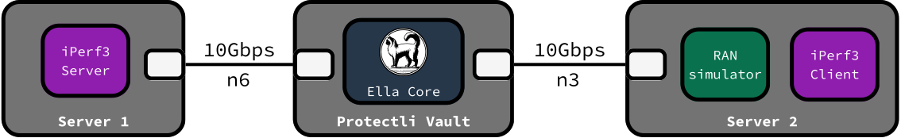

# Performance

This reference document contains performance test results of Ella Core, covering data plane throughput and latency as well as PDU session support.

## Results

### Throughput

The following table outlines the performance test results of Ella Core's data plane throughput:

| Uplink (Gbps) | Downlink (Gbps) |
| ------------- | --------------- |
| 10+           | 10+             |

The tests could saturate the 10Gbps connection consistently, with or without NAT enabled, with CPU
usage peaking at 8%.

### Latency (Round-trip)

The following table outlines the performance test results of Ella Core's data plane latency:

| Average (ms) | Best (ms) | Worst (ms) | Mean Deviation (ms)     |
| ------------ | --------- | ---------- | ----------------------- |
| 1.160        | 0.803     | 1.457      | 0.194                   |

The value represents the round-trip-response times from the UE to the server and back.

### PDU Session Support

Ella Core can support up to **1000 subscribers** using a PDU session simultaneously. This was tested with **ueransim**,
using 10 simulated gNodeBs each handling 100 subscribers.

## Methodology

We performed performance tests with Ella Core running on a baremetal system with the following specifications:

- **OS**: Ubuntu 24.04 LTS
- **CPU**: 12th Gen Intel(R) Core(TM) i5-1540p
- **RAM**: 32GB
- **Disk**: 512GB NVMe SSD
- **NICs**: 2 x Intel Corporation 82599ES 10-Gigabit

The RAN simulator used was [Packet Rusher](https://github.com/HewlettPackard/PacketRusher)

<figure markdown="span">
  { width="800" }
  <figcaption>Performance Testing Environment</figcaption>
</figure>

### Throughput testing

We performed the throughput tests using [iPerf3](https://iperf.fr/).

Test parameters:

- **Version**: v3.16
- **Protocol**: TCP
- **Duration**: 120 seconds
- **Streams**: 4
- **MSS**: 1416 bytes
- **Runs (average over)**: 5

### Latency testing

We performed latency tests using ping.

Test parameters:

- **Count**: 30
