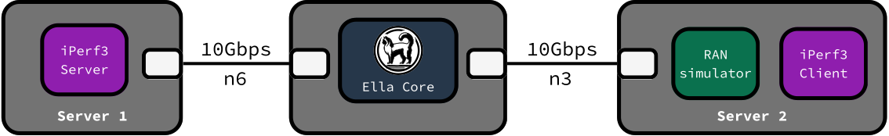

# Performance

This reference document contains performance test results of Ella Core, covering data plane throughput, latency, and session support.

## Results

### Throughput (iPerf3)

The following table outlines the performance test results of Ella Core's data plane throughput:

| Uplink (Gbps) | Downlink (Gbps) |
| ------------- | --------------- |
| 10+           | 10+             |

/// table-caption | <
Data plane throughput (iPerf3)
///

The tests could saturate the 10Gbps connection consistently, with or without NAT enabled, with CPU usage peaking at 8%.

### Throughput (TRex)

The following table outlines Ella Core's data plane throughput in millions of packets per second (Mpps), in `xdp-native` and `tcx` modes, for subscriber IP packets of 46, 494 and 1456 bytes:

<table>
  <thead>
    <tr>
      <th rowspan="2">Mode</th>
      <th rowspan="2">Direction</th>
      <th colspan="3">Throughput (Mpps)</th>
    </tr>
    <tr>
      <th>46 B</th>
      <th>494 B</th>
      <th>1456 B</th>
    </tr>
  </thead>
  <tbody>
    <tr><td rowspan="3"><code>xdp-native</code></td><td>Uplink</td><td>2.05</td><td>2.05</td><td>0.81</td></tr>
    <tr><td>Uplink (NAT)</td><td>1.72</td><td>1.70</td><td>0.81</td></tr>
    <tr><td>Downlink</td><td>3.15</td><td>2.17</td><td>0.81</td></tr>
  </tbody>
  <tbody>
    <tr><td rowspan="3"><code>tcx</code></td><td>Uplink</td><td>0.88</td><td>0.88</td><td>0.81</td></tr>
    <tr><td>Uplink (NAT)</td><td>0.82</td><td>0.82</td><td>0.81</td></tr>
    <tr><td>Downlink</td><td>1.66</td><td>1.58</td><td>0.81</td></tr>
  </tbody>
</table>

/// table-caption | <
Data plane throughput by attach mode and packet size (TRex)
///

The packet size represents only the IP packet for the subscribers and ignores Ethernet and GTP encapsulation.

Downlink performance is higher because the flows can be handled by different cores using [Receive Side Scaling (RSS)](https://www.kernel.org/doc/html/latest/networking/scaling.html).
The uplink flows are all seen by the NIC drivers as the same flow, because of the GTP encapsulation.

Downlink with NAT was not supported by our testing script.

### Latency (Round-trip)

The following table outlines the performance test results of Ella Core's data plane latency:

| Average (ms) | Best (ms) | Worst (ms) | Mean Deviation (ms)     |
| ------------ | --------- | ---------- | ----------------------- |
| 1.160        | 0.803     | 1.457      | 0.194                   |

/// table-caption | <
Data plane round-trip latency
///

The value represents the round-trip-response times from the subscriber's device to the server and back.

### Session Support

Ella Core can support up to **1000 subscribers** using a data session simultaneously. This was tested with **ueransim**, using 10 simulated gNodeBs each handling 100 subscribers.

## Methodology

We performed performance tests with Ella Core running on a baremetal system with the following specifications:

- **OS**: Ubuntu 24.04 LTS
- **CPU**: 12th Gen Intel(R) Core(TM) i5-1540p
- **RAM**: 32GB
- **Disk**: 512GB NVMe SSD
- **NICs**: 2 x Intel Corporation 82599ES 10-Gigabit

The RAN simulator used was [Packet Rusher](https://github.com/HewlettPackard/PacketRusher)

<figure markdown="span">
  { width="800" }
  <figcaption>Performance Testing Environment</figcaption>
</figure>

### iPerf3 Throughput testing

We performed the throughput tests using [iPerf3](https://iperf.fr/).

Test parameters:

- **Version**: v3.16
- **Protocol**: TCP
- **Duration**: 120 seconds
- **Streams**: 4
- **MSS**: 1416 bytes
- **Runs (average over)**: 5

### TRex Throughput testing

We performed those tests using [TRex](https://trex-tgn.cisco.com).

Test parameters:

- **Version**: v3.08
- **Duration**: 120 seconds
- **Drop rate**: 0%
- **Streams**: 64

### Latency testing

We performed latency tests using ping.

Test parameters:

- **Count**: 30
