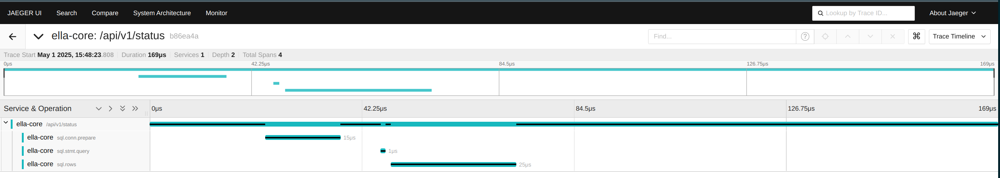
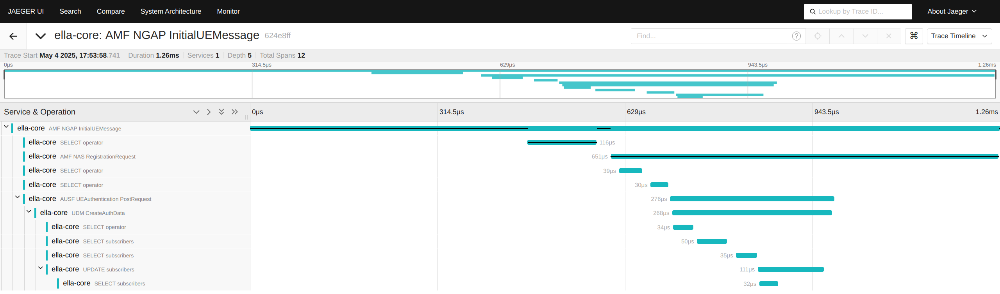

# Tracing

Ella Core supports tracing using [OpenTelemetry](https://opentelemetry.io/). This allows users to collect and export traces from Ella Core to a tracing backend for analysis and visualization.

Traces are collected for the following root components:

## API

Each API call made to Ella Core is traced, allowing users to monitor and analyze the performance of API requests. Each trace includes information about the request, such as the endpoint, method, and response time. Spans may also include database operations.

<figure markdown="span">
  { width="800" }
  <figcaption>Tracing Ella Core's API interfaces.</figcaption>
</figure>

## NGAP

Ella Core's NGAP interface is traced, allowing users to monitor and analyze the performance of NGAP messages. Each trace includes information about the message type, source, destination, and response time. Spans may also include database operations, NAS messages, and internal Network Function calls.

<figure markdown="span">
  { width="800" }
  <figcaption>Tracing Ella Core's NGAP interfaces.</figcaption>
</figure>

## Configuration

For more information on configuring tracing in Ella Core, refer to the [Configuration File](config_file.md) documentation.
