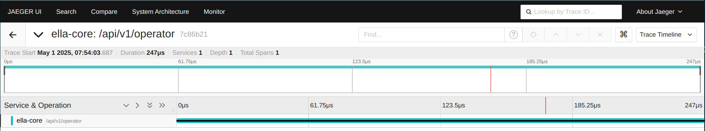

# Tracing (beta)

Ella Core supports tracing using OpenTelemetry. This allows you to collect and export traces from Ella Core to a tracing backend for analysis and visualization.

The tracing configuration is defined in the `tracing` section of the configuration file.

<figure markdown="span">
  { width="800" }
  <figcaption>Tracing in Ella Core</figcaption>
</figure>
