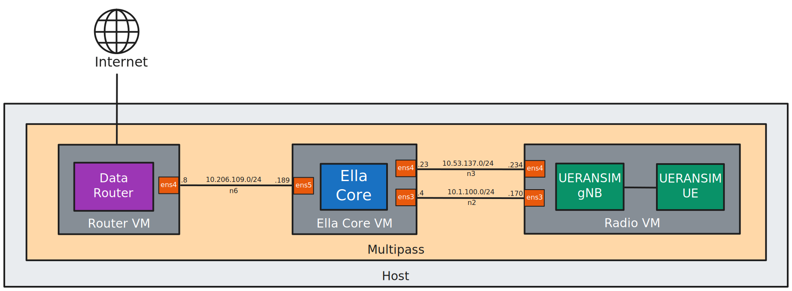
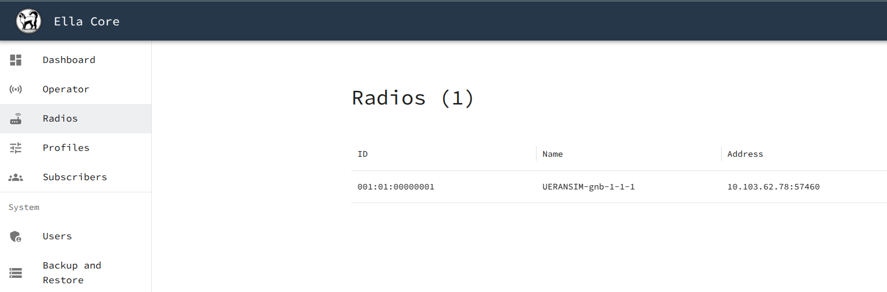

# Running an End-to-End 5G Network with Ella Core

In this tutorial, we will deploy, initialize, and configure Ella Core, an open-source 5G mobile core network. First, we will install Ella Core, access its UI and configure a network subscriber. Then, we will install a 5G radio and User Equipment simulator, connect it to Ella Core, and use the simulator to validate that the subscriber can communicate with the Internet using Ella Core.

You can expect to spend about 10 minutes completing this tutorial.

{ align=center }

## Pre-requisites

To complete this tutorial, you will need a Linux machine with [Docker](https://www.docker.com/) installed.

## 1. Install Ella Core

Create a network named `n3`:

```shell
docker network create --driver bridge n3 --subnet 10.3.0.0/24
```

Start the Ella Core container with the additional network interfaces:

```shell
docker create \
  --name ella-core \
  --privileged \
  -p 5002:5002 \
  -v /sys/fs/bpf:/sys/fs/bpf:rw \
  ella-core:latest exec /bin/core --config /core.yaml
docker network connect --ip 10.3.0.2 n3 ella-core
docker start ella-core
```

## 2. Access the UI

Open your browser and navigate to `http://127.0.0.1:5002/` to access Ella Core's UI.

You should see the Initialization page.

{ align=center }

!!! note
    Your browser may display a warning about the security of the connection. You can safely ignore this warning.

## 3. Configure your private 5G network

### 3.1 Initialize Ella Core

In the Initialization page, create the first user with the following credentials:

- Email: `admin@ellanetworks.com`
- Password: `admin`

Ella Core is now initialized and ready to be used. You will be redirected to the dashboard.

### 3.2 Create a new Subscriber

Navigate to the `Subscribers` page and click on the `Create` button.

Create a subscriber with the following parameters:

- IMSI: `001019756139935`
- Key: `0eefb0893e6f1c2855a3a244c6db1277`
- Sequence Number: Keep the default value.
- OPC: Select "Provide custom OPC" and set the value to `98da19bbc55e2a5b53857d10557b1d26`.
- Policy: `default`

### 3.3 Validate that no radio is connected

Navigate to the `Radios` page. You should see that no radio is connected.

## 4. Integrate a 5G Radio and User Equipment Simulator

In this section, we will run an instance of UERANSIM, a 5G radio and User Equipment (UE) simulator, and connect it to Ella Core.

```shell
docker create \
  --name ueransim \
  --privileged \
  ghcr.io/ellanetworks/ueransim:3.2.7
docker network connect --ip 10.3.0.3 n3 ueransim
docker start ueransim
```

### 4.1 Start the 5G Radio simulator

Start the 5G radio simulator:

```shell
docker exec -ti ueransim bin/nr-gnb --config /gnb.yaml
```

You should see the following output:

```shell
UERANSIM v3.2.7
[2025-10-23 17:12:49.634] [sctp] [info] Trying to establish SCTP connection... (10.3.0.2:38412)
[2025-10-23 17:12:49.635] [sctp] [info] SCTP connection established (10.3.0.2:38412)
[2025-10-23 17:12:49.635] [sctp] [debug] SCTP association setup ascId[35]
[2025-10-23 17:12:49.635] [ngap] [debug] Sending NG Setup Request
[2025-10-23 17:12:49.637] [ngap] [debug] NG Setup Response received
[2025-10-23 17:12:49.637] [ngap] [info] NG Setup procedure is successful
```

Leave the radio running (don't close the terminal).

In your browser, navigate to the Ella Core UI and click on the `Radios` tab. You should see a radio connected with the name `UERANSIM-gnb-1-1-1`.

{ align=center }

### 4.2 Start the 5G User Equipment (UE) simulator

Open a new terminal window and start the UE simulator:

```shell
docker exec -ti ueransim bin/nr-ue --config /ue.yaml
```

You should see the following output:

```shell
UERANSIM v3.2.7
[2025-10-23 17:13:29.224] [nas] [info] UE switches to state [MM-DEREGISTERED/PLMN-SEARCH]
[2025-10-23 17:13:29.225] [rrc] [debug] New signal detected for cell[1], total [1] cells in coverage
[2025-10-23 17:13:29.225] [nas] [info] Selected plmn[001/01]
[2025-10-23 17:13:29.225] [rrc] [info] Selected cell plmn[001/01] tac[1] category[SUITABLE]
[2025-10-23 17:13:29.225] [nas] [info] UE switches to state [MM-DEREGISTERED/PS]
[2025-10-23 17:13:29.225] [nas] [info] UE switches to state [MM-DEREGISTERED/NORMAL-SERVICE]
[2025-10-23 17:13:29.225] [nas] [debug] Initial registration required due to [MM-DEREG-NORMAL-SERVICE]
[2025-10-23 17:13:29.225] [nas] [debug] UAC access attempt is allowed for identity[0], category[MO_sig]
[2025-10-23 17:13:29.225] [nas] [debug] Sending Initial Registration
[2025-10-23 17:13:29.225] [nas] [info] UE switches to state [MM-REGISTER-INITIATED]
[2025-10-23 17:13:29.225] [rrc] [debug] Sending RRC Setup Request
[2025-10-23 17:13:29.225] [rrc] [info] RRC connection established
[2025-10-23 17:13:29.225] [rrc] [info] UE switches to state [RRC-CONNECTED]
[2025-10-23 17:13:29.225] [nas] [info] UE switches to state [CM-CONNECTED]
[2025-10-23 17:13:29.227] [nas] [debug] Authentication Request received
[2025-10-23 17:13:29.227] [nas] [debug] Received SQN [000000000022]
[2025-10-23 17:13:29.227] [nas] [debug] SQN-MS [000000000000]
[2025-10-23 17:13:29.228] [nas] [debug] Security Mode Command received
[2025-10-23 17:13:29.228] [nas] [debug] Selected integrity[1] ciphering[0]
[2025-10-23 17:13:29.229] [nas] [debug] Registration accept received
[2025-10-23 17:13:29.229] [nas] [info] UE switches to state [MM-REGISTERED/NORMAL-SERVICE]
[2025-10-23 17:13:29.229] [nas] [debug] Sending Registration Complete
[2025-10-23 17:13:29.230] [nas] [info] Initial Registration is successful
[2025-10-23 17:13:29.230] [nas] [debug] Sending PDU Session Establishment Request
[2025-10-23 17:13:29.230] [nas] [debug] UAC access attempt is allowed for identity[0], category[MO_sig]
[2025-10-23 17:13:29.443] [nas] [debug] PDU Session Establishment Accept received
[2025-10-23 17:13:29.443] [nas] [info] PDU Session establishment is successful PSI[1]
[2025-10-23 17:13:29.477] [app] [info] Connection setup for PDU session[1] is successful, TUN interface[uesimtun0, 10.45.0.1] is up.
```

This output indicates that the User Equipment has successfully connected to the network and has been assigned an IP address. In this case, the IP address is `10.45.0.1`.

Leave the UE running (don't close the terminal).

## 4. Validate the connection

In your browser, navigate to the Ella Core UI and click on the `Subscribers` tab. You should see that the subscriber you created has been assigned an IP address. The IP address should match the IP address assigned to the UE.

{ align=center }

Open a new terminal window and list the network interfaces inside the UERANSIM container:

```shell
docker exec -ti ueransim ip a
```

You should see a new interface `uesimtun0` with the UE's IP address:

```shell
1: lo: <LOOPBACK,UP,LOWER_UP> mtu 65536 qdisc noqueue state UNKNOWN group default qlen 1000
    link/loopback 00:00:00:00:00:00 brd 00:00:00:00:00:00
    inet 127.0.0.1/8 scope host lo
       valid_lft forever preferred_lft forever
    inet6 ::1/128 scope host
       valid_lft forever preferred_lft forever
2: eth0@if294: <BROADCAST,MULTICAST,UP,LOWER_UP> mtu 1500 qdisc noqueue state UP group default
    link/ether da:be:3e:ba:5d:01 brd ff:ff:ff:ff:ff:ff link-netnsid 0
    inet 10.3.0.3/24 brd 10.3.0.255 scope global eth0
       valid_lft forever preferred_lft forever
3: eth1@if295: <BROADCAST,MULTICAST,UP,LOWER_UP> mtu 1500 qdisc noqueue state UP group default
    link/ether ce:23:b5:6d:ac:94 brd ff:ff:ff:ff:ff:ff link-netnsid 0
    inet 172.17.0.4/16 brd 172.17.255.255 scope global eth1
       valid_lft forever preferred_lft forever
4: uesimtun0: <POINTOPOINT,PROMISC,NOTRAILERS,UP,LOWER_UP> mtu 1400 qdisc fq_codel state UNKNOWN group default qlen 500
    link/none
    inet 10.45.0.1/16 scope global uesimtun0
       valid_lft forever preferred_lft forever
    inet6 fe80::62c0:64c0:99b6:54a/64 scope link stable-privacy
       valid_lft forever preferred_lft forever
```

This interface allows the UE to communicate with the network.

Ping the Ella Core documentation website from the subscriber's interface:

```shell
docker exec -ti ueransim ping -I uesimtun0 docs.ellanetworks.com -c4
```

You should see a successful ping:

```shell
PING docs.ellanetworks.com (172.64.80.1) from 10.45.0.1 uesimtun0: 56(84) bytes of data.
64 bytes from 172.64.80.1: icmp_seq=1 ttl=57 time=23.7 ms
64 bytes from 172.64.80.1: icmp_seq=2 ttl=57 time=18.6 ms
64 bytes from 172.64.80.1: icmp_seq=3 ttl=57 time=22.9 ms
64 bytes from 172.64.80.1: icmp_seq=4 ttl=57 time=35.2 ms

--- docs.ellanetworks.com ping statistics ---
4 packets transmitted, 4 received, 0% packet loss, time 3005ms
rtt min/avg/max/mdev = 18.624/25.115/35.240/6.155 ms
```

!!! success

    Congratulations, you have successfully validated that the subscriber can communicate with the internet.

## 5. Destroy the Tutorial Environment (Optional)

When you are done with the tutorial, you can remove the Ella Core and UERANSIM containers and the networks we created.

```shell
docker stop ella-core ueransim
docker rm ella-core ueransim
docker network rm n3
```
