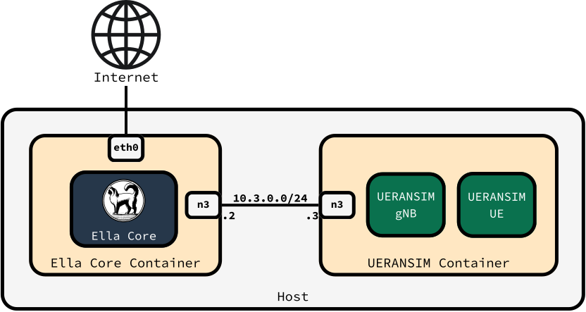
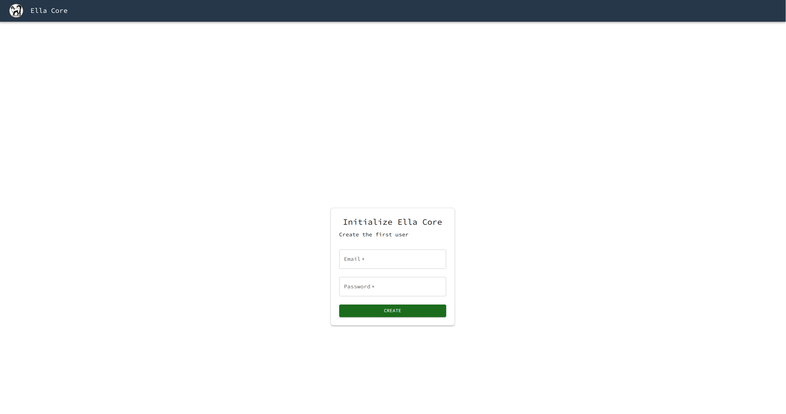

# Running an End-to-End 5G Network with Ella Core

In this tutorial, we will deploy, initialize, and configure Ella Core, an open-source 5G mobile core network. First, we will install Ella Core and UERANSIM (a 5G radio and User Equipment simulator). Then we will access Ella Core's UI and configure a network subscriber. Finally, we will start the 5G radio and user equipment simulators, and validate that the subscriber connects to the network and that it can use this connection to access the internet.

You can expect to spend about 10 minutes completing this tutorial.

{ align=center }

## Pre-requisites

To complete this tutorial, you will need a Linux machine with [Docker](https://www.docker.com/) installed.

## 1. Install Ella Core and UERANSIM

Create a new directory for this tutorial and navigate into it:

```shell
mkdir ella
cd ella
```

Copy the following file into this directory:

```yaml title="docker-compose.yaml"
services:
  ella-core:
    image: ghcr.io/ellanetworks/ella-core:v0.4.2
    restart: unless-stopped
    entrypoint: /bin/core --config /core.yaml
    volumes:
      - /sys/fs/bpf:/sys/fs/bpf:rw
    privileged: true
    ports:
      - "5002:5002"
    networks:
      default:
        driver_opts:
              com.docker.network.endpoint.ifname: eth0
      n3:
        driver_opts:
              com.docker.network.endpoint.ifname: n3
        ipv4_address: 10.3.0.2
  ueransim:
    image: ghcr.io/ellanetworks/ueransim:3.2.7
    restart: unless-stopped
    privileged: true
    networks:
      n3:
        driver_opts:
              com.docker.network.endpoint.ifname: n3
        ipv4_address: 10.3.0.3

networks:
  n3:
    internal: true
    ipam:
      config:
        - subnet: 10.3.0.0/24
```

Start the Ella Core and UERANSIM containers:

```shell
docker compose up -d
```

You should see the following output:

```shell
[+] Running 4/4
 ✔ Network ella_default        Created
 ✔ Network ella_n3             Created
 ✔ Container ella-ella-core-1  Started
 ✔ Container ella-ueransim-1   Started
```

## 2. Access the Ella Core UI

Open your browser and navigate to `http://127.0.0.1:5002/` to access Ella Core's UI.

You should see the Initialization page.

{ align=center }

!!! note
    Your browser may display a warning about the security of the connection. You can safely ignore this warning.

## 3. Configure your private 5G network

### 3.1 Initialize Ella Core

In the Initialization page, create the first user with the following credentials:

- Email: `admin@ellanetworks.com`
- Password: `admin`

Ella Core is now initialized and ready to be used. You will be redirected to the dashboard.

### 3.2 Create a new Subscriber

Navigate to the `Subscribers` page and click on the `Create` button.

Create a subscriber with the following parameters:

- IMSI: `001019756139935`
- Key: `0eefb0893e6f1c2855a3a244c6db1277`
- Sequence Number: Keep the default value.
- OPC: Select "Provide custom OPC" and set the value to `98da19bbc55e2a5b53857d10557b1d26`.
- Policy: Keep the default value.

### 3.3 Validate that no radio is connected

Navigate to the `Radios` page. You should see that no radio is connected.

## 4. Integrate a 5G Radio and User Equipment Simulator

### 4.1 Start the 5G Radio simulator

Go back to your terminal, in the same directory where you created the `docker-compose.yaml` file.

Start the 5G radio simulator:

```shell
docker compose exec -ti ueransim bin/nr-gnb --config /gnb.yaml
```

You should see the following output:

```shell
UERANSIM v3.2.7
[2025-10-24 17:46:43.402] [sctp] [info] Trying to establish SCTP connection... (10.3.0.2:38412)
[2025-10-24 17:46:43.404] [sctp] [info] SCTP connection established (10.3.0.2:38412)
[2025-10-24 17:46:43.404] [sctp] [debug] SCTP association setup ascId[281]
[2025-10-24 17:46:43.404] [ngap] [debug] Sending NG Setup Request
[2025-10-24 17:46:43.405] [ngap] [debug] NG Setup Response received
[2025-10-24 17:46:43.405] [ngap] [info] NG Setup procedure is successful
```

Leave the radio running, don't close the terminal.

In your browser, navigate to the Ella Core UI and click on the `Radios` tab. You should see a radio connected with the name `UERANSIM-gnb-1-1-1`.

{ align=center }

### 4.2 Start the 5G User Equipment (UE) simulator

Open a new terminal window in the same directory where you created the `docker-compose.yaml` file.

Start the UE simulator:

```shell
docker compose exec -ti ueransim bin/nr-ue --config /ue.yaml
```

You should see the following output:

```shell
UERANSIM v3.2.7
[2025-10-24 17:51:25.972] [nas] [info] UE switches to state [MM-DEREGISTERED/PLMN-SEARCH]
[2025-10-24 17:51:25.973] [rrc] [debug] New signal detected for cell[1], total [1] cells in coverage
[2025-10-24 17:51:25.973] [nas] [info] Selected plmn[001/01]
[2025-10-24 17:51:25.973] [rrc] [info] Selected cell plmn[001/01] tac[1] category[SUITABLE]
[2025-10-24 17:51:25.973] [nas] [info] UE switches to state [MM-DEREGISTERED/PS]
[2025-10-24 17:51:25.973] [nas] [info] UE switches to state [MM-DEREGISTERED/NORMAL-SERVICE]
[2025-10-24 17:51:25.973] [nas] [debug] Initial registration required due to [MM-DEREG-NORMAL-SERVICE]
[2025-10-24 17:51:25.973] [nas] [debug] UAC access attempt is allowed for identity[0], category[MO_sig]
[2025-10-24 17:51:25.973] [nas] [debug] Sending Initial Registration
[2025-10-24 17:51:25.973] [nas] [info] UE switches to state [MM-REGISTER-INITIATED]
[2025-10-24 17:51:25.973] [rrc] [debug] Sending RRC Setup Request
[2025-10-24 17:51:25.973] [rrc] [info] RRC connection established
[2025-10-24 17:51:25.973] [rrc] [info] UE switches to state [RRC-CONNECTED]
[2025-10-24 17:51:25.973] [nas] [info] UE switches to state [CM-CONNECTED]
[2025-10-24 17:51:25.975] [nas] [debug] Authentication Request received
[2025-10-24 17:51:25.975] [nas] [debug] Received SQN [000000000022]
[2025-10-24 17:51:25.975] [nas] [debug] SQN-MS [000000000000]
[2025-10-24 17:51:25.976] [nas] [debug] Security Mode Command received
[2025-10-24 17:51:25.976] [nas] [debug] Selected integrity[1] ciphering[0]
[2025-10-24 17:51:25.978] [nas] [debug] Registration accept received
[2025-10-24 17:51:25.978] [nas] [info] UE switches to state [MM-REGISTERED/NORMAL-SERVICE]
[2025-10-24 17:51:25.978] [nas] [debug] Sending Registration Complete
[2025-10-24 17:51:25.978] [nas] [info] Initial Registration is successful
[2025-10-24 17:51:25.978] [nas] [debug] Sending PDU Session Establishment Request
[2025-10-24 17:51:25.978] [nas] [debug] UAC access attempt is allowed for identity[0], category[MO_sig]
[2025-10-24 17:51:26.187] [nas] [debug] PDU Session Establishment Accept received
[2025-10-24 17:51:26.187] [nas] [info] PDU Session establishment is successful PSI[1]
[2025-10-24 17:51:26.211] [app] [info] Connection setup for PDU session[1] is successful, TUN interface[uesimtun0, 10.45.0.1] is up.
```

This output indicates that the User Equipment has successfully connected to the network and has been assigned an IP address. In this case, the IP address is `10.45.0.1`.

Leave the UE running, don't close the terminal.

## 5. Validate the connection

In your browser, navigate to the Ella Core UI and click on the `Subscribers` tab. You should see that the subscriber you created has been assigned an IP address. The IP address should match the IP address assigned to the UE.

{ align=center }

Open a new terminal window in the same directory where you created the `docker-compose.yaml` file.

List the network interfaces inside the UERANSIM container:

```shell
docker compose exec -ti ueransim ip a
```

You should see a new interface `uesimtun0` with the UE's IP address:

```shell
1: lo: <LOOPBACK,UP,LOWER_UP> mtu 65536 qdisc noqueue state UNKNOWN group default qlen 1000
    link/loopback 00:00:00:00:00:00 brd 00:00:00:00:00:00
    inet 127.0.0.1/8 scope host lo
       valid_lft forever preferred_lft forever
    inet6 ::1/128 scope host
       valid_lft forever preferred_lft forever
2: n3@if2038: <BROADCAST,MULTICAST,UP,LOWER_UP> mtu 1500 qdisc noqueue state UP group default
    link/ether a6:cf:98:50:6c:6b brd ff:ff:ff:ff:ff:ff link-netnsid 0
    inet 10.3.0.3/24 brd 10.3.0.255 scope global n3
       valid_lft forever preferred_lft forever
3: uesimtun0: <POINTOPOINT,PROMISC,NOTRAILERS,UP,LOWER_UP> mtu 1400 qdisc fq_codel state UNKNOWN group default qlen 500
    link/none
    inet 10.45.0.1/16 scope global uesimtun0
       valid_lft forever preferred_lft forever
    inet6 fe80::a331:940b:f57a:da80/64 scope link stable-privacy
       valid_lft forever preferred_lft forever
```

This interface allows the UE to communicate with the network.

Ping Google's DNS server from the subscriber's interface:

```shell
docker compose exec -ti ueransim ping -I uesimtun0 8.8.8.8 -c4
```

You should see a successful ping:

```shell
PING 8.8.8.8 (8.8.8.8) from 10.45.0.1 uesimtun0: 56(84) bytes of data.
64 bytes from 8.8.8.8: icmp_seq=1 ttl=116 time=39.0 ms
64 bytes from 8.8.8.8: icmp_seq=2 ttl=116 time=37.9 ms
64 bytes from 8.8.8.8: icmp_seq=3 ttl=116 time=37.4 ms
64 bytes from 8.8.8.8: icmp_seq=4 ttl=116 time=18.9 ms

--- 8.8.8.8 ping statistics ---
4 packets transmitted, 4 received, 0% packet loss, time 3003ms
rtt min/avg/max/mdev = 18.865/33.300/39.038/8.355 ms
```

!!! success

    Congratulations, you have successfully validated that the subscriber can communicate with the internet.

## 6. Destroy the Tutorial Environment (Optional)

When you are done with the tutorial, you can remove the containers and the networks we created.

```shell
docker compose down
```
