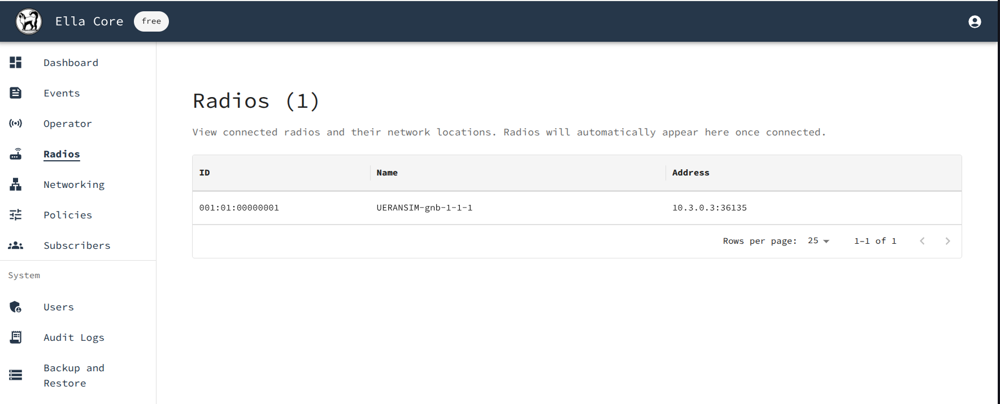
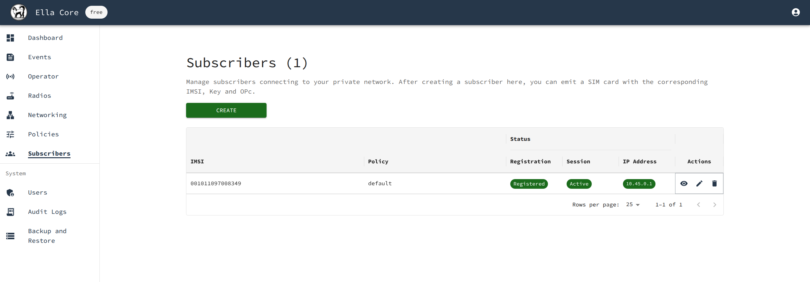

# Running an End-to-End 5G Network with Ella Core

In this tutorial, we will deploy, initialize, and configure Ella Core. First, we will use [Multipass](https://canonical.com/multipass/docs) to create a virtual machine, install Ella Core, access the the UI, initialize Ella Core, and configure it. Then, we will create another virtual machine and install a 5G radio and User Equipment simulator, connect it to Ella Core, and validate that the radio is automatically detected. Then, we will create another virtual machine and set it up as a router. Finally, we will use the User Equipment simulator to validate that the subscriber can communicate with the network.

You can expect to spend about 30 minutes completing this tutorial. Follow the steps in sequence to ensure a successful deployment.

{ align=center }

## Pre-requisites

To complete this tutorial, you will need a Ubuntu 24.04 machine with the following specifications:

- **Memory**: 16GB
- **CPU**: 6 cores
- **Disk**: 50GB

## 1. Create Virtual Machines

From the Ubuntu machine, install LXD and Multipass:

```shell
sudo snap install lxd
```

Initialize LXD:

```shell
sudo lxd init --auto
```

Install Multipass:

```shell
sudo snap install multipass
```

Create three LXD networks:

```shell
lxc network create n2 ipv4.address=22.22.22.1/24
lxc network create n3 ipv4.address=33.33.33.1/24
lxc network create n6 ipv4.address=66.66.66.1/24
```

Create three Multipass instances:

```shell
multipass launch noble --name=ella-core --disk=10G --cpus 2 --network n2 --network n3 --network n6
multipass launch noble --name=router --disk=10G --network n6
multipass launch noble --name=radio --memory=6G --cpus 2 --disk=10G --network n2 --network n3
```

Validate that the 3 instances have been created:

```shell
multipass list
```

You should see the following output:

```shell
Name                    State             IPv4             Image
ella-core               Running           10.194.229.47    Ubuntu 24.04 LTS
                                          22.22.22.71
                                          33.33.33.188
                                          66.66.66.200
radio                   Running           10.194.229.171   Ubuntu 24.04 LTS
                                          22.22.22.129
                                          33.33.33.129
router                  Running           10.194.229.222   Ubuntu 24.04 LTS
                                          66.66.66.173
```

!!! note
    Your instances will have different IP addresses. The tutorial will use the IP addresses from this example. Make sure to replace them with the IP addresses of your instances.

## 2. Install Ella Core

### 2.1 Install and start the Ella Core snap

Connect to the `ella-core` Multipass instance:

```shell
multipass shell ella-core
```

Install the Ella Core snap and connect it to the required interfaces:

```shell
sudo snap install ella-core
sudo snap connect ella-core:network-control
sudo snap connect ella-core:process-control
sudo snap connect ella-core:sys-fs-bpf-upf-pipeline
sudo snap connect ella-core:system-observe
```

Start Ella Core:

```shell
sudo snap start ella-core.cored
```

### 2.2 Access the UI

From the host, open your browser and navigate to `https://<ella-core-ens3-ip>:5002/` to access Ella Core's UI. Replace the placeholder with the appropriate value.

You should see the Initialization page.

{ align=center }

!!! note
    Your browser may display a warning about the security of the connection. This is because the certificate used by Ella Core is self-signed. You can safely ignore this warning.

### 2.3 Initialize Ella Core

In the Initialization page, create the first user with the following credentials:

- Email: `admin@ellanetworks.com`
- Password: `admin`

After creating the user, you will be redirected to the login page. Use the credentials you just created to log in.

You will be redirected to the dashboard.

Ella Core is now initialized and ready to be used.

### 2.5 Configure your private network

Here, we will navigate through the Ella Core UI to create a profile, a subscriber, and a route.

#### 2.5.1 Create a Profile

Navigate to the `Profiles` page and click on the `Create` button.

Create a profile with the name `default`. You can keep the default values for the other parameters:

- Name: `default`
- IP Pool: `10.45.0.0/16`
- DNS: `8.8.8.8`
- MTU: `1500`
- Bitrate Uplink: `200 Mbps`
- Bitrate Downlink: `100 Mbps`

#### 2.5.2 Create a subscriber

Navigate to the `Subscribers` page and click on the `Create` button.

Create a subscriber with the following parameters:

- IMSI: Click on "Generate" to automatically generate the MSIN.
- Key: Click on "Generate" to automatically generate a key.
- Sequence Number: Keep the default value.
- Profile: `default`

After creating the subscriber, click on the `View` button to see the subscriber's details. Note the IMSI, Key, and OPC values. You will use these values later to configure the 5G radio simulator.

#### 2.5.3 Create a route

Navigate to the `Routes` page and click on the `Create` button.

Create a route with the following parameters:

- Destination: `default`
- Gateway: `<router-ens4-ip>`
- Interface: `n6`
- Metric: `0`

Replace the placeholder with the appropriate value.

#### 2.5.4 Validate that no radio is connected

Navigate to the `Radios` page. You should see that no radio is connected.

## 3. Configure the router

Open a shell into the `router` Multipass instance:

```shell
multipass shell router
```

Enable IP forwarding:

```shell
sudo sysctl -w net.ipv4.ip_forward=1
```

Enable NAT for the `10.45.0.0/16` subnet by rewriting the source IP address of packets leaving the system to the IP address of the router's outgoing interface (`ens3`):

```shell
sudo iptables -t nat -A POSTROUTING -o ens3 -s 10.45.0.0/16 -j MASQUERADE
```

Add a route to the `ella-core` Multipass instance:

```shell
sudo ip route add 10.45.0.0/16 via <ella-core-ens6-ip> dev ens4
```

Replace the placeholder with the appropriate value.

Exit the Multipass instance:

```shell
exit
```

## 4. Install a 5G Radio Simulator

In this section, we will install UERANSIM, a 5G radio and User Equipment (UE) simulator, and connect it to Ella Core.

### 4.1 Install and start the UERANSIM 5G radio simulator

Connect to the `radio` Multipass instance:

```shell
multipass shell radio
```

Install the UERANSIM snap:

```shell
sudo snap install ueransim --channel=edge
sudo snap connect ueransim:network-control
```

Note the IP address of the `ens4` and `ens5` interfaces.

```shell
ip a
```

Edit the configuration file at `/var/snap/ueransim/common/gnb.yaml`:

```yaml hl_lines="9 10 13"
mcc: '001'
mnc: '01'

nci: '0x000000010'
idLength: 32
tac: 1

linkIp: 127.0.0.1
ngapIp: <radio-ens4-ip>
gtpIp:  <radio-ens5-ip>

amfConfigs:
  - address: <ella-core-ens4-ip>
    port: 38412

slices:
  - sst: 0x1
    sd: 0x102030

ignoreStreamIds: true
```

Make sure to modify the highlighted placeholder values.

Start the 5G radio:

```shell
ueransim.nr-gnb --config /var/snap/ueransim/common/gnb.yaml
```

You should see the following output:

```shell
UERANSIM v3.2.6
[2025-02-01 10:07:38.223] [sctp] [info] Trying to establish SCTP connection... (22.22.22.71:38412)
[2025-02-01 10:07:38.240] [sctp] [info] SCTP connection established (22.22.22.71:38412)
[2025-02-01 10:07:38.240] [sctp] [debug] SCTP association setup ascId[3]
[2025-02-01 10:07:38.240] [ngap] [debug] Sending NG Setup Request
[2025-02-01 10:07:38.247] [ngap] [debug] NG Setup Response received
[2025-02-01 10:07:38.247] [ngap] [info] NG Setup procedure is successful
```

Leave the radio running.

In your browser, navigate to the Ella Core UI and click on the `Radios` tab. You should see a radio connected with the name `UERANSIM-gnb-1-1-1`.

{ align=center }

### 4.3 Start the UERANSIM 5G User Equipment (UE) simulator

Open a new terminal window and connect to the `radio` Multipass instance:

```shell
multipass shell radio
```

Edit the configuration file at `/var/snap/ueransim/common/ue.yaml`:

```yaml hl_lines="1 9 10"
supi: 'imsi-001019756139935' # The IMSI of the subscriber you created
mcc: '001'
mnc: '01'
protectionScheme: 0
homeNetworkPublicKey: '75d1dde9519b390b172104ae3397557a114acbd39d3c39b2bcc3ce282abc4c3e'
homeNetworkPublicKeyId: 1
routingIndicator: '0000'

key: '0eefb0893e6f1c2855a3a244c6db1277'  # The key of the subscriber you created
op: '98da19bbc55e2a5b53857d10557b1d26'   # The opc of the subscriber you created
opType: 'OPC'
amf: '8000'
imei: '356938035643803'
imeiSv: '4370816125816151'

gnbSearchList:
  - 127.0.0.1

uacAic:
  mps: false
  mcs: false

uacAcc:
  normalClass: 0
  class11: false
  class12: false
  class13: false
  class14: false
  class15: false

sessions:
  - type: 'IPv4'
    apn: 'internet'
    slice:
      sst: 0x01
      sd: 0x102030

configured-nssai:
  - sst: 0x01
    sd: 0x102030

default-nssai:
  - sst: 1
    sd: 1

integrity:
  IA1: true
  IA2: true
  IA3: true

ciphering:
  EA1: true
  EA2: true
  EA3: true

integrityMaxRate:
  uplink: 'full'
  downlink: 'full'
```

Modify the highlighted values:

- `supi`: The `imsi` value used by the subscriber with the prefix `imsi-`.
- `key`: The `key` value used by the subscriber.
- `op`: The `opc` value used by the subscriber.

Those values were noted when you created the subscriber at step 2.5.2.

Start the User Equipment (UE) simulator:

```shell
sudo ueransim.nr-ue --config /var/snap/ueransim/common/ue.yaml
```

You should see the following output:

```shell
UERANSIM v3.2.6
[2025-01-25 16:29:02.683] [nas] [info] UE switches to state [MM-DEREGISTERED/PLMN-SEARCH]
[2025-01-25 16:29:02.685] [rrc] [debug] New signal detected for cell[1], total [1] cells in coverage
[2025-01-25 16:29:02.685] [nas] [info] Selected plmn[001/01]
[2025-01-25 16:29:02.685] [rrc] [info] Selected cell plmn[001/01] tac[1] category[SUITABLE]
[2025-01-25 16:29:02.685] [nas] [info] UE switches to state [MM-DEREGISTERED/PS]
[2025-01-25 16:29:02.685] [nas] [info] UE switches to state [MM-DEREGISTERED/NORMAL-SERVICE]
[2025-01-25 16:29:02.685] [nas] [debug] Initial registration required due to [MM-DEREG-NORMAL-SERVICE]
[2025-01-25 16:29:02.685] [nas] [debug] UAC access attempt is allowed for identity[0], category[MO_sig]
[2025-01-25 16:29:02.685] [nas] [debug] Sending Initial Registration
[2025-01-25 16:29:02.687] [nas] [info] UE switches to state [MM-REGISTER-INITIATED]
[2025-01-25 16:29:02.687] [rrc] [debug] Sending RRC Setup Request
[2025-01-25 16:29:02.687] [rrc] [info] RRC connection established
[2025-01-25 16:29:02.687] [rrc] [info] UE switches to state [RRC-CONNECTED]
[2025-01-25 16:29:02.687] [nas] [info] UE switches to state [CM-CONNECTED]
[2025-01-25 16:29:02.717] [nas] [debug] Authentication Request received
[2025-01-25 16:29:02.717] [nas] [debug] Received SQN [000000000001]
[2025-01-25 16:29:02.717] [nas] [debug] SQN-MS [000000000000]
[2025-01-25 16:29:02.717] [nas] [debug] Sending Authentication Failure due to SQN out of range
[2025-01-25 16:29:02.738] [nas] [debug] Authentication Request received
[2025-01-25 16:29:02.738] [nas] [debug] Received SQN [000000000021]
[2025-01-25 16:29:02.738] [nas] [debug] SQN-MS [000000000000]
[2025-01-25 16:29:02.739] [nas] [debug] Security Mode Command received
[2025-01-25 16:29:02.739] [nas] [debug] Selected integrity[1] ciphering[0]
[2025-01-25 16:29:02.741] [nas] [debug] Registration accept received
[2025-01-25 16:29:02.741] [nas] [info] UE switches to state [MM-REGISTERED/NORMAL-SERVICE]
[2025-01-25 16:29:02.741] [nas] [debug] Sending Registration Complete
[2025-01-25 16:29:02.741] [nas] [info] Initial Registration is successful
[2025-01-25 16:29:02.741] [nas] [debug] Sending PDU Session Establishment Request
[2025-01-25 16:29:02.743] [nas] [debug] UAC access attempt is allowed for identity[0], category[MO_sig]
[2025-01-25 16:29:02.979] [nas] [debug] PDU Session Establishment Accept received
[2025-01-25 16:29:02.979] [nas] [info] PDU Session establishment is successful PSI[1]
[2025-01-25 16:29:03.020] [app] [info] Connection setup for PDU session[1] is successful, TUN interface[uesimtun0, 10.45.0.1] is up.
```

This output indicates that the User Equipment has successfully connected to the network and has been assigned an IP address. In this case, the IP address is `10.45.0.1`.

Leave the UE running.

## 5. Validate the connection

In your browser, navigate to the Ella Core UI and click on the `Subscribers` tab. You should see that the subscriber you created has been assigned an IP address. The IP address should match the IP address assigned to the UE.

{ align=center }

Open a new terminal window and connect to the `radio` Multipass instance:

```shell
multipass shell radio
```

List the network interfaces:

```shell
ip a
```

You should see a new interface `uesimtun0` with the UE's IP address:

```shell
1: lo: <LOOPBACK,UP,LOWER_UP> mtu 65536 qdisc noqueue state UNKNOWN group default qlen 1000
    link/loopback 00:00:00:00:00:00 brd 00:00:00:00:00:00
    inet 127.0.0.1/8 scope host lo
       valid_lft forever preferred_lft forever
    inet6 ::1/128 scope host noprefixroute 
       valid_lft forever preferred_lft forever
2: ens3: <BROADCAST,MULTICAST,UP,LOWER_UP> mtu 1500 qdisc fq_codel state UP group default qlen 1000
    link/ether 52:54:00:85:ac:05 brd ff:ff:ff:ff:ff:ff
    altname enp0s3
    inet 10.194.229.171/24 metric 100 brd 10.194.229.255 scope global ens3
       valid_lft forever preferred_lft forever
    inet6 fe80::5054:ff:fe85:ac05/64 scope link 
       valid_lft forever preferred_lft forever
3: ens4: <BROADCAST,MULTICAST,UP,LOWER_UP> mtu 1500 qdisc fq_codel state UP group default qlen 1000
    link/ether 52:54:00:7b:7a:c6 brd ff:ff:ff:ff:ff:ff
    altname enp0s4
    inet 22.22.22.129/24 metric 200 brd 22.22.22.255 scope global dynamic ens4
       valid_lft 3153sec preferred_lft 3153sec
    inet6 fd42:6302:4a59:7ee5:5054:ff:fe7b:7ac6/64 scope global mngtmpaddr noprefixroute 
       valid_lft forever preferred_lft forever
    inet6 fe80::5054:ff:fe7b:7ac6/64 scope link 
       valid_lft forever preferred_lft forever
4: ens5: <BROADCAST,MULTICAST,UP,LOWER_UP> mtu 1500 qdisc fq_codel state UP group default qlen 1000
    link/ether 52:54:00:84:4b:9f brd ff:ff:ff:ff:ff:ff
    altname enp0s5
    inet 33.33.33.129/24 metric 200 brd 33.33.33.255 scope global dynamic ens5
       valid_lft 3153sec preferred_lft 3153sec
    inet6 fd42:ae6c:c837:fbc0:5054:ff:fe84:4b9f/64 scope global mngtmpaddr noprefixroute 
       valid_lft forever preferred_lft forever
    inet6 fe80::5054:ff:fe84:4b9f/64 scope link 
       valid_lft forever preferred_lft forever
5: uesimtun0: <POINTOPOINT,PROMISC,NOTRAILERS,UP,LOWER_UP> mtu 1400 qdisc fq_codel state UNKNOWN group default qlen 500
    link/none 
    inet 10.45.0.1/32 scope global uesimtun0
       valid_lft forever preferred_lft forever
    inet6 fe80::26e6:470b:dc9d:9f95/64 scope link stable-privacy 
       valid_lft forever preferred_lft forever
```

This interface allows the UE to communicate with the network. 

Ping the Ella Core documentation website from the subscriber's interface:

```shell
ping -I uesimtun0 docs.ellanetworks.com -c4
```

You should see a successful ping:

```shell
PING ellanetworks.github.io (185.199.108.153) from 10.45.0.1 uesimtun0: 56(84) bytes of data.
64 bytes from cdn-185-199-108-153.github.com (185.199.108.153): icmp_seq=1 ttl=55 time=44.7 ms
64 bytes from cdn-185-199-108-153.github.com (185.199.108.153): icmp_seq=2 ttl=55 time=43.6 ms
64 bytes from cdn-185-199-108-153.github.com (185.199.108.153): icmp_seq=3 ttl=55 time=44.3 ms
64 bytes from cdn-185-199-108-153.github.com (185.199.108.153): icmp_seq=4 ttl=55 time=52.5 ms

--- ellanetworks.github.io ping statistics ---
4 packets transmitted, 4 received, 0% packet loss, time 3005ms
rtt min/avg/max/mdev = 43.565/46.274/52.539/3.639 ms
```

Now, use curl to fetch the Ella Core documentation website:

```shell
curl --interface uesimtun0 https://docs.ellanetworks.com
```

You should see the HTML content of the Ella Core documentation website.

You have successfully validated that the subscriber can communicate with the internet.

## 6. Destroy the Tutorial Environment (Optional)

When you are done with the tutorial, you can destroy the Multipass instances:

```shell
multipass delete ella-core radio router --purge
```

You can also delete the networks created with LXD:

```shell
lxc network delete n2
lxc network delete n3
lxc network delete n6
```
