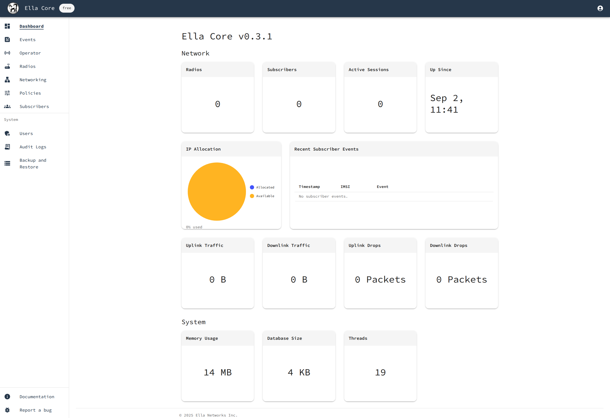

# Getting Started

In this tutorial, we will deploy, initialize, and configure Ella Core. We will install Ella Core and access its UI via a web browser.

You can expect to spend about 5 minutes completing this tutorial.

## Pre-requisites

To complete this tutorial, you will need a Linux machine with [Docker](https://www.docker.com/) installed.

## 1. Install Ella Core

Create a new directory for this tutorial and navigate into it:

```shell
mkdir ella
cd ella
```

Copy the following file into this directory:

```yaml title="docker-compose.yaml"
services:
  ella-core:
    image: ghcr.io/ellanetworks/ella-core:v0.4.1
    restart: unless-stopped
    entrypoint: /bin/core --config /core.yaml
    volumes:
      - /sys/fs/bpf:/sys/fs/bpf:rw
    privileged: true
    ports:
      - "5002:5002"
    networks:
      default:
        driver_opts:
              com.docker.network.endpoint.ifname: eth0
      n3:
        driver_opts:
              com.docker.network.endpoint.ifname: n3
        ipv4_address: 10.3.0.2

networks:
  n3:
    internal: true
    ipam:
      config:
        - subnet: 10.3.0.0/24
```

Start the Ella Core and UERANSIM containers:

```shell
docker compose up -d
```

You should see the following output:

```shell
[+] Running 3/3
 ✔ Network ella_n3             Created
 ✔ Network ella_default        Created
 ✔ Container ella-ella-core-1  Started
```

## 2. Access the UI

Open your browser and navigate to `http://127.0.0.1:5002` to access Ella Core's UI.

You should see the Initialization page.

{ align=center }

!!! note
    Your browser may display a warning about the connection's security. You can safely ignore this warning.

## 3. Initialize Ella Core

On the Initialization page, create the first user with the following credentials:

- Email: `admin@ellanetworks.com`
- Password: `admin`

After creating the user, Ella Core will redirect you to the dashboard.

{ align=center }

!!! success

    You have successfully deployed and initialized Ella Core. You can now use Ella Core to manage your private 5G network.

## 4. Destroy the Tutorial Environment (Optional)

When you are done with the tutorial, you can remove the Ella Core container and the networks we created.

```shell
docker compose down
```
