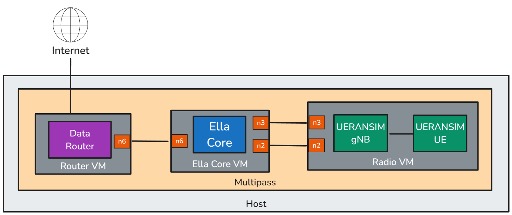

# Getting Started

In this tutorial, we will deploy, initialize, and configure Ella Core. First, we will use [Multipass](https://canonical.com/multipass/docs) to create a virtual machine, install Ella Core, access the the UI, initialize Ella Core, and configure it. Then, we will create another virtual machine and install a 5G radio and User Equipment simulator, connect it to Ella Core, and validate that the radio is automatically detected. Then, we will create another virtual machine and set it up as a router. Finally, we will use the User Equipment simulator to validate that the subscriber can communicate with the network.

You can expect to spend about 30 minutes completing this tutorial. Follow the steps in sequence to ensure a successful deployment.

{ align=center }

## Pre-requisites

To complete this tutorial, you will need a Ubuntu 24.04 machine with the following specifications:

- 16GB of RAM
- 6 CPU cores
- 50GB of disk space


## 1. Create the Virtual Machines

From the Ubuntu machine, install Multipass:

```shell
sudo snap install multipass
```

Create two lxc networks:

```shell
lxc network create n3
lxc network create n6
```

Create three Multipass instances:

```shell
multipass launch noble --name=ella-core --disk=10G --network n3 --network n6
multipass launch noble --name=router --disk=10G --network n6
multipass launch noble --name=radio --memory=6G --cpus 2 --disk=10G  --network n3
```

Validate that the 3 instances have been created:

```shell
multipass list
```

You should see the following output:

```shell
guillaume@courge:~$ multipass list
Name                    State             IPv4             Image
ella-core               Running           10.103.62.82     Ubuntu 24.04 LTS
                                          10.243.161.86
                                          10.117.122.61
radio                   Running           10.103.62.28     Ubuntu 24.04 LTS
                                          10.243.161.22
router                  Running           10.103.62.238    Ubuntu 24.04 LTS
                                          10.117.122.224
```

## 2. Install Ella Core

### 2.1 Setup the Virtual Machine where Ella Core will be installed

Connect to the `ella-core` Multipass instance:

```shell
multipass shell ella-core
```

Validate that the instance has the two additional network interfaces:

```shell
ip a
```

You should see that the instance has four network interfaces: `lo`, `ens3`, `ens4`, and `ens5`. Note the IP address of the `ens3` and `ens4` interfaces. 

### 2.2 Install and start Ella Core

Inside of the `ella-core` Multipass instance, install the Ella Core snap:

```shell
sudo snap install ella-core --channel=edge --devmode
```

Edit the configuration file at `/var/snap/ella-core/common/core.yaml` to configure the network interfaces:

```yaml hl_lines="7 11"
log-level: "info"
db:
  path: "/var/snap/ella-core/common/data/core.db"
interfaces: 
  n2:
    name: "ens3"
    address: "10.103.62.227"    # The `ens3` IP address of the ella-core Multipass instance.
    port: 38412
  n3:
    name: "ens4"
    address: "10.243.161.26"    # The `ens4` IP address of the ella-core Multipass instance.
  n6:
    name: "ens5"
  api:
    name: "lo"
    port: 5002
    tls:
      cert: "/var/snap/ella-core/common/cert.pem"
      key: "/var/snap/ella-core/common/key.pem"
```

Modify the highlighted values:

- `interfaces.n2.address`: The `ens3` IP address of the `ella-core` Multipass instance.
- `interfaces.n3.address`: The `ens4` IP address of the `ella-core` Multipass instance.

Start Ella Core:

```shell
sudo snap start ella-core.cored
```

Validate that Ella Core is running:

```shell
sudo snap services ella-core.cored
```

You should see that the service is active:

```shell
ubuntu@ella-core:~$ sudo snap services ella-core.cored 
Service          Startup   Current  Notes
ella-core.cored  disabled  active   -
```

### 2.3 Configure routing

Enable IP forwarding:

```shell
sudo sysctl -w net.ipv4.ip_forward=1
```

Create a default route to the router:
```shell
sudo ip route add default via 10.117.122.224 dev ens5
```

<!-- 
test:
```shell
ip route replace default via 192.168.250.1 metric 110
ip route replace 192.168.251.0/24 via 192.168.252.1
``` -->

Here, replace the IP address with the IP address of the `ens4` interface of the `router` Multipass instance.

Exit the Multipass instance:
```shell
exit
```

### 2.4 Access the UI

Navigate to `https://<your instance IP>:5002` to access Ella Core's UI. Use the IP address you noted at step 1.1.

You should see the Initialization page.

{ align=center }

!!! note
    Your browser may display a warning about the security of the connection. This is because the certificate used by Ella Core is self-signed. You can safely ignore this warning.

### 2.5 Initialize Ella Core

In the Initialization page, create the first user with the following credentials:

- Email: `admin@ellanetworks.com`
- Password: `admin`

After creating the user, you will be redirected to the login page. Use the credentials you just created to log in.

You will be redirected to the dashboard.

Ella Core is now initialized and ready to be used.

### 2.6 Create a Profile and a Subscriber

Here, we will navigate through the Ella Core UI to create a profile, and a subscriber.

#### 2.6.1 Create a Profile

Navigate to the `Profiles` page and click on the `Create` button.

Create a profile with the name `default`. You can keep the default values for the other parameters:

- Name: `default`
- UE IP Pool: `172.250.0.0/24`
- DNS: `8.8.8.8`
- MTU: `1500`
- Bitrate Uplink: `200 Mbps`
- Bitrate Downlink: `100 Mbps`

#### 2.6.2 Create a subscriber

Navigate to the `Subscribers` page and click on the `Create` button.

Create a subscriber with the following parameters:

- IMSI: Click on "Generate" to automatically generate the MSIN.
- Key: Click on "Generate" to automatically generate a key.
- Sequence Number: Keep the default value.
- Profile: `default`

After creating the subscriber, click on the `View` button to see the subscriber's details. Note the IMSI, Key, and OPC values. You will use these values later to configure the UE simulator.

#### 2.6.3 Validate that no radio is connected

Navigate to the `Radios` page. You should see that no radio is connected.

## 3. Install a 5G Radio Simulator

In this section, we will install UERANSIM, a 5G radio simulator and connect it to Ella Core.

### 3.1 Install and start the UERANSIM 5G radio simulator

Connect to the `radio` Multipass instance:

```shell
multipass shell radio
```

Install the UERANSIM snap:

```shell
sudo snap install ueransim --channel=edge
sudo snap connect ueransim:network-control
```

Note the IP address of the `ens3` and `ens4` interfaces.

```shell
ip a
```

Edit the configuration file at `/var/snap/ueransim/common/gnb.yaml`:

```yaml hl_lines="9 10 13"
mcc: '001'
mnc: '01'

nci: '0x000000010'
idLength: 32
tac: 1

linkIp: 127.0.0.1
ngapIp: 10.103.62.78       # The `ens3` IP address of the `radio` Multipass instance.
gtpIp:  10.243.161.33      # The `ens4` IP address of the `radio` Multipass instance.

amfConfigs:
  - address: 10.103.62.49  # The `ens3` IP address of the `ella-core` Multipass instance.
    port: 38412

slices:
  - sst: 0x1
    sd: 0x102030

ignoreStreamIds: true
```

Modify the highlighted values:

- `ngapIp`: The `ens3` IP address of the `radio` Multipass instance.
- `gtpIp`: The `ens4` IP address of the `radio` Multipass instance.
- `amfConfigs.address`: The `ens3` IP address of the `ella-core` Multipass instance.

Start the 5G radio:

```shell
ueransim.nr-gnb --config /var/snap/ueransim/common/gnb.yaml
```

You should see the following output:

```shell
ubuntu@radio:~$ ueransim.nr-gnb --config /var/snap/ueransim/common/gnb.yaml 
UERANSIM v3.2.6
[2025-01-18 16:38:41.616] [sctp] [info] Trying to establish SCTP connection... (10.103.62.49:38412)
[2025-01-18 16:38:41.631] [sctp] [info] SCTP connection established (10.103.62.49:38412)
[2025-01-18 16:38:41.631] [sctp] [debug] SCTP association setup ascId[3]
[2025-01-18 16:38:41.631] [ngap] [debug] Sending NG Setup Request
[2025-01-18 16:38:41.635] [ngap] [debug] NG Setup Response received
[2025-01-18 16:38:41.635] [ngap] [info] NG Setup procedure is successful
```

Leave the radio running.

In your browser, navigate to the Ella Core UI and click on the `Radios` tab. You should see a radio connected with the name `UERANSIM-gnb-1-1-1`.

{ align=center }

### 3.3 Install and start the UERANSIM 5G User Equipment (UE) simulator

Open a new terminal window and connect to the `radio` Multipass instance:

```shell
multipass shell radio
```

Edit the configuration file at `/var/snap/ueransim/common/ue.yaml`:

```yaml hl_lines="1 9 10"
supi: 'imsi-001010100007487' # The IMSI of the subscriber you created
mcc: '001'
mnc: '01'
protectionScheme: 0
homeNetworkPublicKey: '75d1dde9519b390b172104ae3397557a114acbd39d3c39b2bcc3ce282abc4c3e'
homeNetworkPublicKeyId: 1
routingIndicator: '0000'

key: '5122250214c33e723a5dd523fc145fc0'  # The key of the subscriber you created
op: '981d464c7c52eb6e5036234984ad0bcf'   # The opc of the subscriber you created
opType: 'OPC'
amf: '8000'
imei: '356938035643803'
imeiSv: '4370816125816151'

gnbSearchList:
  - 127.0.0.1

uacAic:
  mps: false
  mcs: false

uacAcc:
  normalClass: 0
  class11: false
  class12: false
  class13: false
  class14: false
  class15: false

sessions:
  - type: 'IPv4'
    apn: 'internet'
    slice:
      sst: 0x01
      sd: 0x102030

configured-nssai:
  - sst: 0x01
    sd: 0x102030

default-nssai:
  - sst: 1
    sd: 1

integrity:
  IA1: true
  IA2: true
  IA3: true

ciphering:
  EA1: true
  EA2: true
  EA3: true

integrityMaxRate:
  uplink: 'full'
  downlink: 'full'
```

Modify the highlighted values:

- `supi`: The `imsi` value used by the UE with the prefix `imsi-`.
- `key`: The `key` value used by the UE.
- `op`: The `opc` value used by the UE.

Those values were noted when you created the subscriber at step 1.5.2.

Start the UE:

```shell
sudo ueransim.nr-ue --config /var/snap/ueransim/common/ue.yaml
```

You should see the following output:

```shell
ubuntu@radio:~$ sudo ueransim.nr-ue --config /var/snap/ueransim/common/ue.yaml
UERANSIM v3.2.6
[2025-01-19 12:56:18.097] [nas] [info] UE switches to state [MM-DEREGISTERED/PLMN-SEARCH]
[2025-01-19 12:56:18.099] [rrc] [debug] New signal detected for cell[1], total [1] cells in coverage
[2025-01-19 12:56:18.099] [nas] [info] Selected plmn[001/01]
[2025-01-19 12:56:18.099] [rrc] [info] Selected cell plmn[001/01] tac[1] category[SUITABLE]
[2025-01-19 12:56:18.099] [nas] [info] UE switches to state [MM-DEREGISTERED/PS]
[2025-01-19 12:56:18.099] [nas] [info] UE switches to state [MM-DEREGISTERED/NORMAL-SERVICE]
[2025-01-19 12:56:18.099] [nas] [debug] Initial registration required due to [MM-DEREG-NORMAL-SERVICE]
[2025-01-19 12:56:18.099] [nas] [debug] UAC access attempt is allowed for identity[0], category[MO_sig]
[2025-01-19 12:56:18.099] [nas] [debug] Sending Initial Registration
[2025-01-19 12:56:18.101] [nas] [info] UE switches to state [MM-REGISTER-INITIATED]
[2025-01-19 12:56:18.101] [rrc] [debug] Sending RRC Setup Request
[2025-01-19 12:56:18.102] [rrc] [info] RRC connection established
[2025-01-19 12:56:18.102] [rrc] [info] UE switches to state [RRC-CONNECTED]
[2025-01-19 12:56:18.102] [nas] [info] UE switches to state [CM-CONNECTED]
[2025-01-19 12:56:18.124] [nas] [debug] Authentication Request received
[2025-01-19 12:56:18.124] [nas] [debug] Received SQN [000000000001]
[2025-01-19 12:56:18.124] [nas] [debug] SQN-MS [000000000000]
[2025-01-19 12:56:18.124] [nas] [debug] Sending Authentication Failure due to SQN out of range
[2025-01-19 12:56:18.136] [nas] [debug] Authentication Request received
[2025-01-19 12:56:18.136] [nas] [debug] Received SQN [000000000021]
[2025-01-19 12:56:18.136] [nas] [debug] SQN-MS [000000000000]
[2025-01-19 12:56:18.138] [nas] [debug] Security Mode Command received
[2025-01-19 12:56:18.139] [nas] [debug] Selected integrity[1] ciphering[0]
[2025-01-19 12:56:18.141] [nas] [debug] Registration accept received
[2025-01-19 12:56:18.141] [nas] [info] UE switches to state [MM-REGISTERED/NORMAL-SERVICE]
[2025-01-19 12:56:18.141] [nas] [debug] Sending Registration Complete
[2025-01-19 12:56:18.141] [nas] [info] Initial Registration is successful
[2025-01-19 12:56:18.141] [nas] [debug] Sending PDU Session Establishment Request
[2025-01-19 12:56:18.141] [nas] [debug] UAC access attempt is allowed for identity[0], category[MO_sig]
[2025-01-19 12:56:18.367] [nas] [debug] PDU Session Establishment Accept received
[2025-01-19 12:56:18.368] [nas] [info] PDU Session establishment is successful PSI[1]
[2025-01-19 12:56:18.411] [app] [info] Connection setup for PDU session[1] is successful, TUN interface[uesimtun0, 192.168.0.1] is up.
```

Here, note the last line of the output. It indicates that the UE has successfully connected to the network and has been assigned an IP address. In this case, the IP address is `192.168.0.1`.

Leave the UE running.

## 4. Setup the Router

Open a new terminal window and connect to the `router` Multipass instance:

```shell
multipass shell router
```

Enable IP forwarding:

```shell
sudo sysctl -w net.ipv4.ip_forward=1
```

```shell
sudo iptables -t nat -A POSTROUTING -s 192.168.0.0/24 -j MASQUERADE
```

Exit the Multipass instance:

```shell
exit
```

## 5. Validate the connection

In your browser, navigate to the Ella Core UI and click on the `Subscribers` tab. You should see that the subscriber you created has been assigned an IP address. This IP address is the IP address of the UE and should match with the IP address you noted at step 2.3.

{ align=center }

Open a new terminal window and connect to the `radio` Multipass instance:

```shell
multipass shell radio
```

Validate that a new interface has been created:

```shell
ubuntu@radio:~$ ip a
1: lo: <LOOPBACK,UP,LOWER_UP> mtu 65536 qdisc noqueue state UNKNOWN group default qlen 1000
    link/loopback 00:00:00:00:00:00 brd 00:00:00:00:00:00
    inet 127.0.0.1/8 scope host lo
       valid_lft forever preferred_lft forever
    inet6 ::1/128 scope host noprefixroute 
       valid_lft forever preferred_lft forever
2: ens3: <BROADCAST,MULTICAST,UP,LOWER_UP> mtu 1500 qdisc fq_codel state UP group default qlen 1000
    link/ether 52:54:00:9d:1f:b1 brd ff:ff:ff:ff:ff:ff
    altname enp0s3
    inet 10.103.62.78/24 metric 100 brd 10.103.62.255 scope global ens3
       valid_lft forever preferred_lft forever
    inet6 fe80::5054:ff:fe9d:1fb1/64 scope link 
       valid_lft forever preferred_lft forever
3: ens4: <BROADCAST,MULTICAST,UP,LOWER_UP> mtu 1500 qdisc fq_codel state UP group default qlen 1000
    link/ether 52:54:00:97:9f:1d brd ff:ff:ff:ff:ff:ff
    altname enp0s4
    inet 10.243.161.33/24 metric 200 brd 10.243.161.255 scope global dynamic ens4
       valid_lft 2978sec preferred_lft 2978sec
    inet6 fd42:2ccb:7e5b:6a97:5054:ff:fe97:9f1d/64 scope global mngtmpaddr noprefixroute 
       valid_lft forever preferred_lft forever
    inet6 fe80::5054:ff:fe97:9f1d/64 scope link 
       valid_lft forever preferred_lft forever
4: uesimtun0: <POINTOPOINT,PROMISC,NOTRAILERS,UP,LOWER_UP> mtu 1400 qdisc fq_codel state UNKNOWN group default qlen 500
    link/none 
    inet 10.45.0.1/32 scope global uesimtun0
       valid_lft forever preferred_lft forever
    inet6 fe80::44dd:c457:46da:c04f/64 scope link stable-privacy 
       valid_lft forever preferred_lft forever
```

You should see a new interface `uesimtun0` with your UE's IP address. This interface allows the UE to communicate with the network. 

For instance, you can use the `ping` command to validate that the UE can communicate with the network:

```shell
ping -I uesimtun0 8.8.8.8
```

!!! success
    
    You have successfully connected a 5G radio simulator and a UE simulator to Ella Core. You can now use the UE to browse the internet, make calls, etc.

## 6. Destroy the Tutorial Environment

When you are done with the tutorial, you can destroy the Multipass instances:

```shell
multipass delete ella-core --purge
multipass delete radio --purge
```

You can also delete the two lxc networks:

```shell
lxc network delete n3
lxc network delete n6
```
