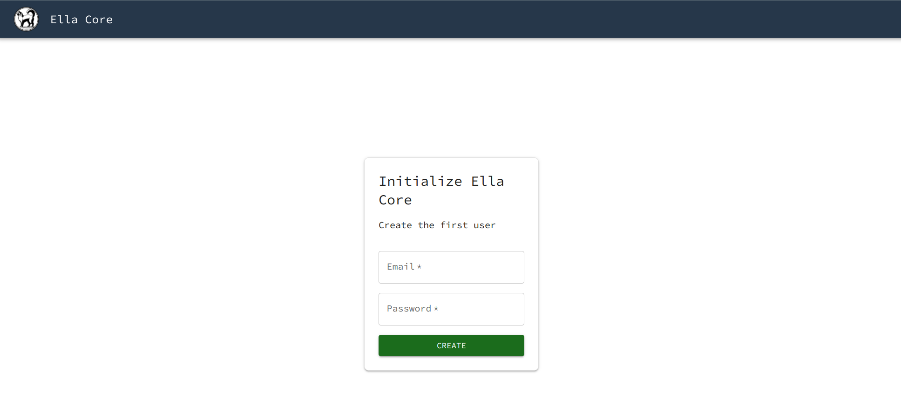

# Getting Started (5G Network with Radio Hardware)

In this tutorial, we will deploy a complete end-to-end 5G network using Ella Core with a real 5G radio and user equipment. We will install Ella Core on bare metal using Snap, burn a SIM card, configure the network, and validate that a subscriber can connect and reach the internet.

You can expect to spend about 30 minutes completing this tutorial.

## Pre-requisites

To complete this tutorial, you will need the following:

**Server**

- A Linux machine running Ubuntu 24.04 LTS (or another [supported OS](../reference/system_reqs.md))
- 2 network interfaces:
    - One for the radio connection (N2/N3 — control and user plane)
    - One for internet connectivity (N6 — data network) and the API/UI
- See the full [system requirements](../reference/system_reqs.md)

**5G Equipment**

- A [compatible 5G radio](../reference/supported_5g_equipment.md#radios)
- A [compatible user equipment](../reference/supported_5g_equipment.md#user-equipment) (phone, module, etc.)

**SIM Card Provisioning**

- Programmable SIM cards (e.g. [Sysmocom sysmoISIM-SJA5](https://sysmocom.de/products/sim/sysmoisim-sja5/index.html))
- A SIM card reader/writer (e.g. [HID OmniKey 3121](https://www.hidglobal.com/products/omnikey-3121))
- [pySim](https://github.com/osmocom/pysim) installed on your machine

## 1. Install Ella Core

Install the Ella Core snap and connect the required interfaces:

```shell
sudo snap install ella-core
sudo snap connect ella-core:network-control
sudo snap connect ella-core:process-control
sudo snap connect ella-core:system-observe
sudo snap connect ella-core:firewall-control
```

## 2. Configure Ella Core

Edit the configuration file:

```shell
sudo vim /var/snap/ella-core/common/config.yaml
```

Set the network interfaces to match your system. In this example, `ens5` is connected to the radio and `ens3` is connected to the internet:

```yaml title="/var/snap/ella-core/common/config.yaml"
logging:
  system:
    level: "info"
    output: "stdout"
  audit:
    output: "stdout"
db:
  path: "core.db"
interfaces:
  n2:
    name: "ens5"
    port: 38412
  n3:
    name: "ens5"
  n6:
    name: "ens3"
  api:
    address: "0.0.0.0"
    port: 5002
xdp:
  attach-mode: "native"
```

!!! note
    Replace `ens5` and `ens3` with the actual interface names on your machine. N2 and N3 should point to the interface connected to the radio. N6 should point to the interface connected to the internet. See the [configuration reference](../reference/config_file.md) for all available options.

Start Ella Core:

```shell
sudo snap start --enable ella-core.cored
```

## 3. Initialize Ella Core

Open your browser and navigate to `https://<server-ip>:5002/` to access Ella Core's UI.

You should see the Initialization page.

{ align=center }

Create the first user with your chosen credentials (e.g. `admin@ellanetworks.com` / `admin`).

Ella Core is now initialized. You will be redirected to the dashboard.

## 4. Configure the Operator

Navigate to the `Operator` page and configure the operator information to match your radio's settings:

- **MCC**: Your Mobile Country Code (e.g. `001` for testing)
- **MNC**: Your Mobile Network Code (e.g. `01` for testing)
- **Supported TACs**: The Tracking Area Codes your radio will use
- **SST**: The Slice/Service Type (e.g. `1` for eMBB)
- **SD**: The Service Differentiator (e.g. `010203`)

!!! note
    The MCC, MNC, TAC, SST, and SD values must match between Ella Core and your radio's configuration. Consult your radio's documentation for its expected values, or configure both sides to match.

## 5. Create a Subscriber

Navigate to the `Subscribers` page and click on the `Create` button.

Create a subscriber with the following parameters:

- **IMSI**: Choose an IMSI that matches your MCC/MNC (e.g. `001010000000001`)
- **Key**: Generate a random 128-bit key in hex (e.g. `465B5CE8B199B49FAA5F0A2EE238A6BC`)
- **Sequence Number**: Keep the default value
- **OPC**: Generate a random 128-bit OPC in hex (e.g. `E8ED289DEBA952E4283B54E88E6183CA`)
- **Policy**: Keep the default value

Take note of the **IMSI**, **Key**, and **OPC** values. You will need them to burn the SIM card.

## 6. Burn the SIM Card

Insert a blank programmable SIM card into your card reader.

Use pySim to program the SIM card with the subscriber credentials from the previous step:

```shell
export IMSI=001010000000001
export KEY=465B5CE8B199B49FAA5F0A2EE238A6BC
export OPC=E8ED289DEBA952E4283B54E88E6183CA
export MCC=001
export MNC=01
export ADMIN_CODE=76543210
./pySim-prog.py -p0 -n Ella -t sysmoISIM-SJA5 -i $IMSI -c $MCC -x $MCC -y $MNC -o $OPC -k $KEY -a $ADMIN_CODE -j 1
```

!!! note
    The `ADMIN_CODE` is specific to your SIM card vendor. For Sysmocom cards, the default is `76543210`. Check your vendor's documentation for the correct value.

!!! note
    Some devices (e.g. iPhones) require additional SUCI configuration on the SIM card. See [Managing SIM Cards](../explanation/managing_sim_cards.md) for details.

Insert the programmed SIM card into your user equipment.

## 7. Connect the Radio

Configure your 5G radio to connect to Ella Core. You will need to set:

- **AMF Address**: The IP address of the N2 interface on your server
- **PLMN ID**: The MCC and MNC you configured in Ella Core
- **TAC**: A Tracking Area Code from the supported TACs list
- **SST/SD**: The slice values you configured in Ella Core

Power on the radio. For detailed instructions, see [Integrate with a Radio](../how_to/integrate_with_radio.md).

In the Ella Core UI, navigate to the `Radios` page. You should see your radio appear as connected.

## 8. Connect the User Equipment

Power on the user equipment with the programmed SIM card inserted. The device should automatically search for and connect to your network.

In the Ella Core UI, navigate to the `Subscribers` page. You should see that your subscriber has been assigned an IP address, confirming a successful PDU session establishment.

## 9. Validate the Connection

From the user equipment, try to access the internet (e.g. open a web browser and navigate to any website, or ping an external address).

!!! success

    Congratulations! You have deployed a complete end-to-end 5G network with real hardware. Your subscriber is connected through Ella Core and can reach the internet.
